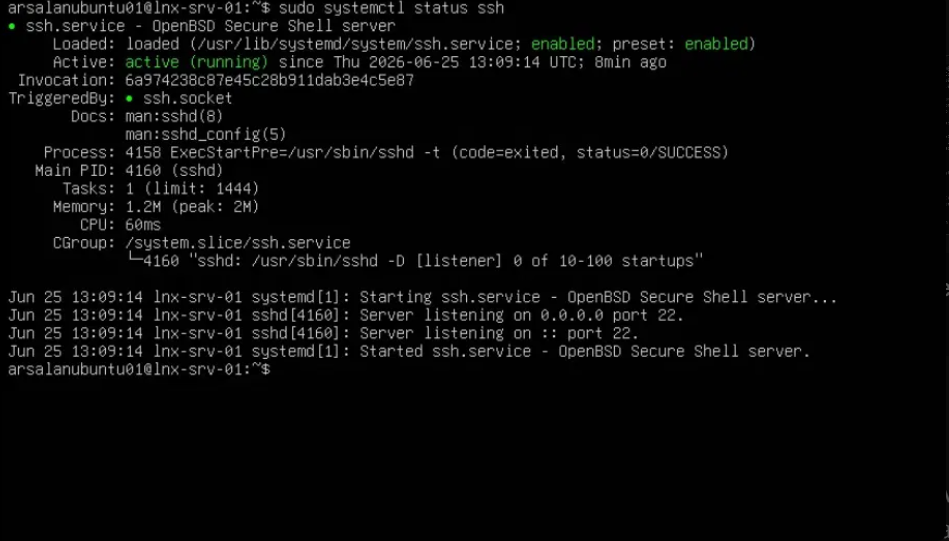
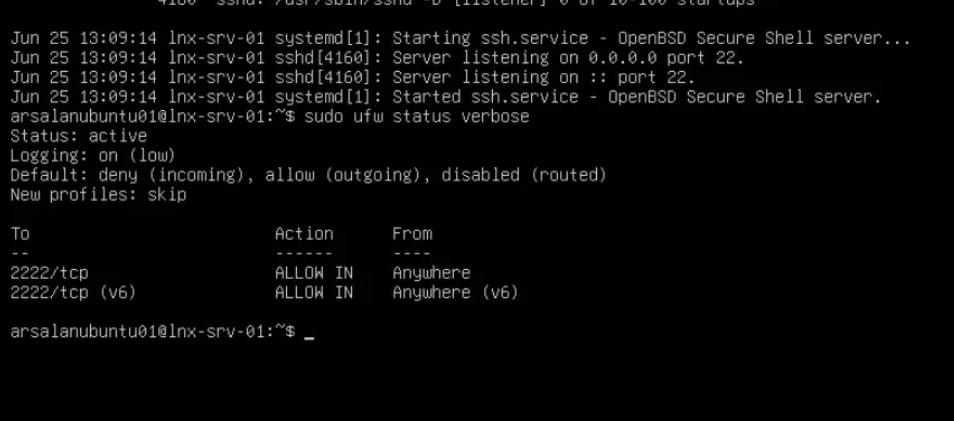
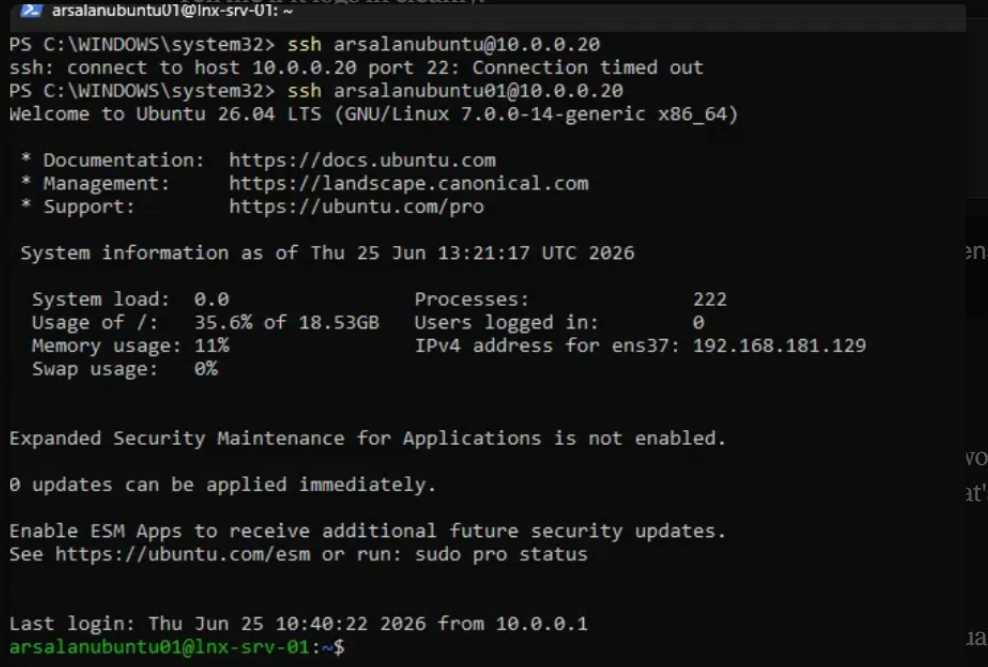
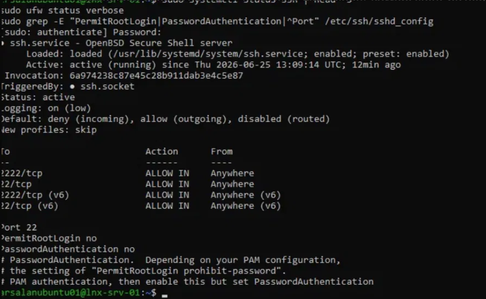
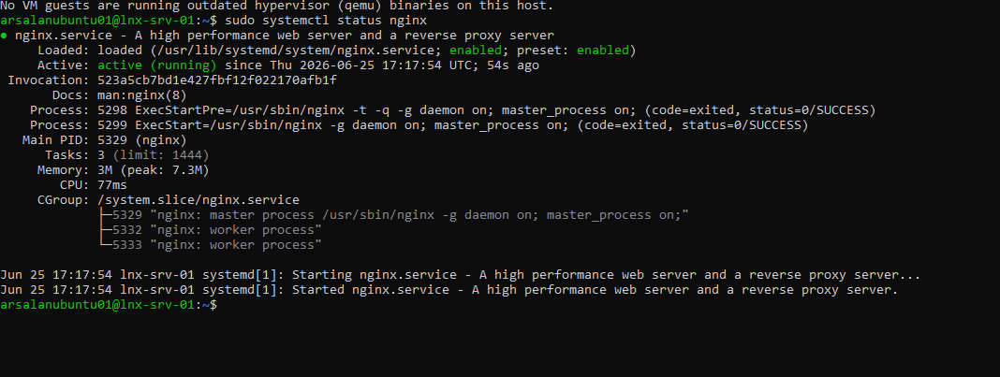
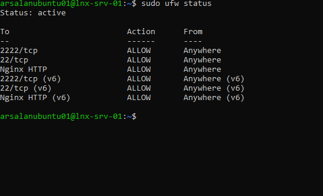
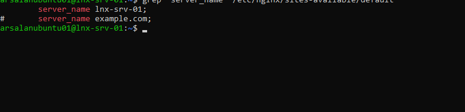
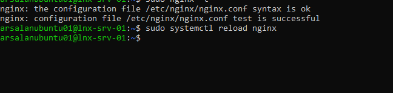

# Phase 2.6–2.9: Linux Server Hardening & Web Operations

**Server:** LNX-SRV-01 (Ubuntu Server 26.04 LTS)
**Network:** Host-only `VMnet1` (10.0.0.20/24) + NAT `VMnet8` (ens37, internet egress)

---

## Phase 2.6: Secure Linux Operations (SSH Hardening)

**Objective:** Eliminate clear-text credential exposure by enforcing SSH key-pair
authentication, then lock down the attack surface via `sshd_config` hardening
and `ufw` firewall rules.

### Implementation

1. Generated an ED25519 key pair on the management host (Windows):
   ```
   ssh-keygen -t ed25519 -C "lnx-srv-01-access"
   ```
2. Deployed the public key to `~/.ssh/authorized_keys` on LNX-SRV-01.
3. **Verified key-based login succeeded before removing the password fallback** —
   never cut off the current access method until the replacement is tested working.
4. Hardened `/etc/ssh/sshd_config`:
   - `PermitRootLogin no`
   - `PasswordAuthentication no`
5. Configured `ufw`: default deny incoming, explicit allow for SSH.

**Verification — SSH service active and listening:**



### Incident: ufw / sshd Port Mismatch (Real-World Troubleshooting)

During implementation, `ufw` was configured to allow port `2222` while `sshd`
remained listening on port `22` — a partial port-migration that broke external
SSH access while the service itself reported healthy.

**Evidence of the broken state — `ufw` only permitting 2222/tcp:**



**Diagnosis process:**
- `ping 10.0.0.20` succeeded → ruled out host-down / routing failure
- `ssh 10.0.0.20` timed out → isolated the fault to a specific service/port
- `systemctl status ssh` → service `active (running)`, listening on port 22
  → ruled out SSH service failure
- `ufw status verbose` → only port `2222` allowed → **root cause confirmed**

**Resolution:**
```
sudo ufw allow 22/tcp
```

**Recovery confirmed — first attempt times out (pre-fix), second attempt succeeds (post-fix):**



**Final verified state — firewall rules and sshd_config hardening confirmed together:**



```
sudo ufw status verbose
sudo grep -E "PermitRootLogin|PasswordAuthentication|^Port" /etc/ssh/sshd_config
```

### Outstanding
- Default port (22) not yet changed per Elite Standard — deferred. Current
  configuration is fully secure (key-only auth, root login disabled)
  independent of which port is in use.
- Leftover unused `ufw` rule for `2222/tcp` — cosmetic cleanup pending
  (`sudo ufw delete allow 2222/tcp`).

---

## Phase 2.7: Linux Web Administration (Nginx)


**Objective:** Stand up an active Nginx web environment, deepening package
management (`apt`) and text-processing (`grep`, `sed`) fluency through direct
configuration-file inspection and editing.

### Implementation

1. Confirmed internet connectivity prior to installation:
   ```
   ping -c 4 8.8.8.8
   ```
2. Updated package lists and installed Nginx:
   ```
   sudo apt update
   sudo apt install nginx -y
   ```
3. Verified the service was active and enabled:
   ```
   sudo systemctl status nginx
   ```

**Verification — Nginx active and running, registered with `systemctl` and `ufw` automatically on install:**



4. Opened the firewall for HTTP traffic using Nginx's auto-registered `ufw` application profile:
   ```
   sudo ufw allow 'Nginx HTTP'
   sudo ufw status
   ```

**Verification — firewall rule confirmed (IPv4 + IPv6):**



5. Confirmed end-to-end functionality by requesting the page from the host browser at `http://10.0.0.20`.

**Verification — default Nginx page served successfully to host browser:**


### Configuration Review & Editing (Depth Work)

Rather than leave the default configuration untouched, reviewed
`/etc/nginx/sites-available/default` in full, then used `grep` to isolate the
active directives from the surrounding template comments:

```
grep "listen" /etc/nginx/sites-available/default
```

This confirmed the server was listening on port 80 (IPv4 and IPv6), with the
SSL (443) and example virtual-host blocks present only as commented-out
templates — not active.

**Made a real configuration change** — updated the generic `server_name _;`
catch-all to explicitly identify the host:

```
sudo sed -i 's/server_name _;/server_name lnx-srv-01;/' /etc/nginx/sites-available/default
```

**Incident (minor): silent edit failure caught via verification, not assumed success.**
The first `sed` attempt produced no error but also made no actual change —
confirmed via a follow-up `grep` rather than trusting the absence of an error
message. Re-ran the command and verified the change took effect on the second
attempt.

**Verification — `server_name` correctly updated, confirmed via grep (not assumed):**



Validated syntax before applying, then reloaded without dropping active connections:

```
sudo nginx -t
sudo systemctl reload nginx
```

**Verification — syntax check passed, reload applied cleanly:**



### Outstanding
- TLS/SSL configuration deferred to Phase 2.8 (OpenSSL certificate generation)
- Reverse-proxy configuration (routing to Docker containers) deferred to Phase 3.4

# Phase 2.8 — Cryptographic Certificate Lifecycle (OpenSSL/TLS on Nginx)

**Objective:** Generate and deploy a self-signed TLS certificate to enable encrypted HTTPS on the Nginx web server, building foundational PKI and certificate-handling competency.

## What Was Done

- Generated a self-signed X.509 certificate and 2048-bit RSA private key using OpenSSL (`openssl req -x509 -newkey rsa:2048 -days 365`), with the Common Name set to `lnx-srv-01`
- Locked down the private key to `600` permissions (root read/write only), enforcing least privilege — the certificate itself remains world-readable as `644`, since certificates are public by design and only the private key is sensitive
- Appended a new `server {}` block to `/etc/nginx/sites-available/default`, configuring `listen 443 ssl;` and pointing `ssl_certificate` / `ssl_certificate_key` at the generated files
- Validated the configuration with `nginx -t` **before** applying it live, then applied the change with `systemctl reload nginx` (zero-downtime reload, not a full restart)
- Verified success at the network level using `ss -tlnp`, confirming Nginx listening on both `0.0.0.0:80` (HTTP) and `0.0.0.0:443` (HTTPS)

## Why Self-Signed, Not a Public CA

`lnx-srv-01` is an internal-only hostname on an isolated lab network — public Certificate Authorities like Let's Encrypt require internet-reachable domain validation, which doesn't apply here. Self-signed certificates are the correct and standard pattern for internal enterprise services, internal APIs, and lab/dev environments — this mirrors real production practice for internal-only endpoints, not a simplification of it.

## Key Principle Demonstrated

**Least privilege** — the private key is restricted to the one account (root) that the Nginx master process needs, with no broader access granted.

## Evidence

**OpenSSL certificate and key generation:**


**Nginx configuration validation and HTTPS verification:**


*Shows `nginx -t` returning "syntax is ok" / "test is successful" prior to reload, followed by `ss -tlnp` confirming Nginx listening on both port 80 and port 443 after reload.*

## Outcome

Nginx now serves both HTTP and HTTPS, with traffic on port 443 encrypted using a locally-trusted self-signed certificate. Configuration was validated before being applied live, and the result was confirmed at the network level rather than assumed from command success alone.
# Phase 2.9 — Local Name Resolution & System Resource-Awareness

**Objective:** Configure DNS forward and reverse lookup records on DC01 to enable name-based resolution for `LNX-SRV-01`, and build foundational Linux resource-awareness fluency (`ps`, `top`, `df`, `du`) to establish an honest health baseline before Phase 3 introduces Docker.

## Part 1: DNS Forward and Reverse Resolution

**What was done:**
- Confirmed via `Get-DnsServerZone` that no reverse lookup zone existed yet for the `10.0.0.x` network — only default placeholder zones (`0`, `127`, `255.in-addr.arpa`) were present
- Created a new Active Directory-integrated reverse lookup zone, `0.0.10.in-addr.arpa`, via DNS Manager's New Zone Wizard, matching the existing forward zone's replication and update settings
- Created a Host (A) record (`lnx-srv-01` → `10.0.0.20`) in the existing `corp.infralab.local` forward zone, with "Create associated pointer (PTR) record" enabled to generate both records in a single action
- Verified both records via `Get-DnsServerResourceRecord`, confirming exactly one A record existed with no duplication
- Demonstrated the PowerShell equivalent (`Add-DnsServerResourceRecordA -CreatePtr`) — correctly returned an "already exists" error against the PTR record, confirmed as expected behaviour rather than a fault, since both records were already present from the GUI step
- Verified actual end-to-end resolution (not just record presence) using `Resolve-DnsName` in both directions

**Verification results:**
- `Resolve-DnsName lnx-srv-01.corp.infralab.local` → correctly resolved to `10.0.0.20`
- `Resolve-DnsName 10.0.0.20` → correctly resolved to `lnx-srv-01.corp.infralab.local`

**Why this matters:** An IP address identifies a machine's current location on the network; a name identifies what the machine *is*, independent of where it currently sits. DNS is the layer that lets the rest of the environment depend on a stable name rather than a fragile, potentially-changing address. Forward (A) and reverse (PTR) records are maintained as structurally separate systems, not two views of one fact — which is why reverse zones require deliberate, explicit setup and don't appear automatically.

**Evidence:**


*The new `0.0.10.in-addr.arpa` reverse lookup zone, showing the PTR record for `10.0.0.20` correctly pointing back to `lnx-srv-01.corp.infralab.local`.*


*`Resolve-DnsName` confirming functional, end-to-end resolution in both directions — not just record presence in the management console.*

## Part 2: Linux Resource-Awareness Baseline

**What was done:**
- Used `ps aux | grep nginx` and `ps aux | grep sshd` to inspect running processes, observing the privilege-separation pattern in both services: a root-owned parent/listener process handling the minimum privileged operations (port binding, authentication), with actual work handed off to lower-privileged contexts (`www-data` for Nginx workers, the authenticated user's own session for SSH)
- Used `top` to capture a live system health snapshot
- Used `df -h` to check overall filesystem capacity
- Used `sudo du -h --max-depth=1 /var | sort -rh | head -10` to identify what was consuming disk space within `/var`

**Baseline results:**
- Load average: `0.00, 0.00, 0.00` — system idle, no CPU contention
- CPU: 99.8% idle
- Memory: 3.35GB total, only 642MB actively used
- Disk (`/`): 19GB total, 7.3GB used, 11GB free (42% utilisation)
- `/var` breakdown: 610M total — largest contributors were `/var/cache` (359M, mostly apt package cache) and `/var/lib` (219M, installed package data); `/var/log` at a healthy 32M

**Why this matters:** Phase 3 introduces Docker, which will have multiple containerised workloads competing for this machine's resources. Establishing a factual, evidence-based baseline now — rather than assuming the machine has headroom — means any future resource pressure introduced by containers can be measured against a known starting point, rather than guessed at.

**Evidence:**


*Live `top` snapshot confirming a healthy, mostly-idle system: load average 0.00 across all intervals, 99.8% CPU idle, and the majority of memory free or held in reclaimable cache.*

## Outcome

`LNX-SRV-01` is now resolvable by name in both directions via DNS, and confirmed to have substantial spare CPU, memory, and disk capacity ahead of Phase 3.
