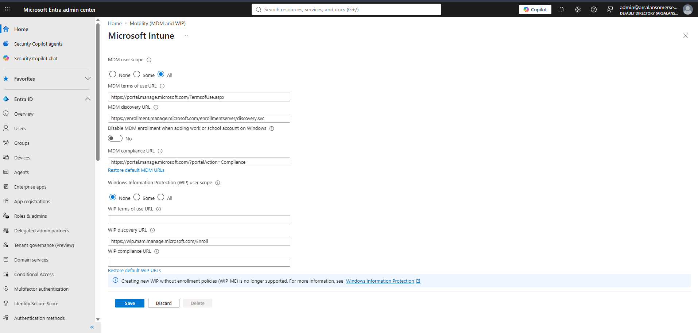
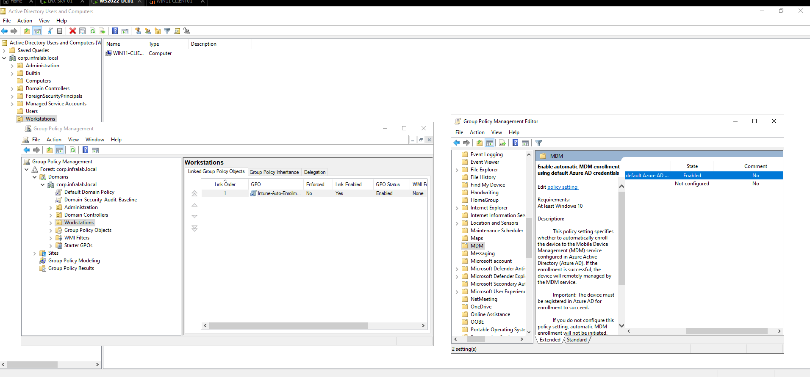

# Phase 4.3 — Unified Endpoint Control (Microsoft Intune)

**Objective:** Bring the hybrid-joined Windows 11 workstation under cloud-based management with Microsoft Intune using an automated enrolment pattern, then author and deploy real device compliance and configuration controls (BitLocker, USB mass-storage restriction) and enforce them through Conditional Access — demonstrating Zero Trust endpoint enforcement, not just policy authoring.

**Depends on Phase 4.2:** the device must exist in Entra ID (hybrid joined). Satisfied — `WIN11-CLIENT01` is Microsoft Entra hybrid joined.

---

## 1. Concept — MDM, auto-enrolment, and why it's "Zero Trust"

**Mobile Device Management (MDM)** is cloud-based control of an endpoint: Intune pushes configuration, security baselines, and compliance rules to the device and continuously reports its state back. In a Zero Trust model, a device earns access by *proving it is healthy* — not by sitting inside a trusted network. Intune is the mechanism that both enforces "healthy" and reports it to Conditional Access.

**Automatic enrolment** means a device becomes Intune-managed on its own, with no user clicking "enrol." For a Microsoft Entra hybrid joined device this needs **two** things working together:

1. **A cloud switch** — Entra must know Intune is the MDM authority and which users may auto-enrol (MDM user scope).
2. **A device instruction** — a Group Policy telling the domain-joined machine to enrol into Intune using its Entra credentials.

Switch + GPO = automatic enrolment "without manual intervention," exactly as the spec requires.

*Interview relevance (Endpoint/MDM Administrator, and National Grid-type roles):* auto-enrolment, compliance baselines, and Conditional Access device gating are core modern endpoint-management skills employers ask about directly.

---

## 2. Auto-enrolment configured

### 2.1 Cloud switch — MDM user scope

In **Entra → Mobility (MDM and MAM) → Microsoft Intune**, set **MDM user scope = All** so any licensed user's Windows device can auto-enrol (only the E5-licensed pilot users can actually enrol, since enrolment consumes an Intune licence). Default MDM Terms of Use / Discovery / Compliance URLs retained; MAM/WIP scope left None.

*Evidence 1 — Intune set as MDM authority with auto-enrolment scope = All.*

### 2.2 Device instruction — auto-enrolment Group Policy

Created a **Workstations** OU and moved `WIN11-CLIENT01` into it (keeps the policy off the domain controller — a DC is never enrolled into Intune). Created and linked GPO **Intune-Auto-Enrollment** to the Workstations OU, with:

**Computer Configuration → Administrative Templates → Windows Components → MDM → "Enable automatic MDM enrollment using default Azure AD credentials" = Enabled.**

*Evidence 2 — auto-enrolment GPO enabled and scoped to the Workstations OU.*

**Design note — targeting (principle: least scope / blast radius).** The GPO is linked to a dedicated Workstations OU rather than the domain root, so it applies only to client machines and can never pull the domain controller into MDM. The device was moved into that OU for the policy to reach it (GPOs link to OUs, not the default `Computers` container).

---
3. Endpoint controls — authored & deployed

Three tenant-side controls were authored and assigned. Together they define what a "healthy" device is (compliance), harden it (configuration), and enforce the verdict (Conditional Access).

3.1 Compliance policy — require BitLocker

Intune Windows compliance policy WIN-Compliance-Baseline requiring BitLocker and Secure Boot, assigned to All devices. This is Intune's definition of a healthy device; its Compliant / Non-Compliant verdict is what Conditional Access reads.

Show Image
Evidence 3 — compliance baseline requiring BitLocker + Secure Boot.

3.2 Configuration profile — block USB mass storage

Device-restrictions profile WIN-USB-Block setting Removable storage = Block, assigned to All devices — closing the classic data-exfiltration and malware-ingress path of USB mass-storage devices.

Show Image
Evidence 4 — removable/USB mass storage blocked via configuration profile.

3.3 Conditional Access enforcement — the Zero Trust gate

Conditional Access policy CA02 (block non-compliant devices) was moved from Report-only to On, scoped to the pilot users, with the break-glass Global Admin excluded. This is the step that turns policy authoring into policy enforcement: a device that fails the compliance baseline is now actively blocked from resources, while a compliant device passes.

Show Image
Evidence 5 — Conditional Access enforcing device compliance (Zero Trust gate live).

Principle named — Zero Trust / verify explicitly. Access is granted per-device based on continuously-evaluated health, not on network location. Compliance policy defines health; Conditional Access enforces it; together they are the enforcement loop, not just documentation.

4. Status — honest position

Authored, deployed and verified:

Intune set as MDM authority; MDM user scope = All (Evidence 1).
Auto-enrolment GPO enabled and scoped to the Workstations OU (Evidence 2).
Compliance baseline (BitLocker + Secure Boot) deployed to all devices (Evidence 3).
USB mass-storage block deployed to all devices (Evidence 4).
Conditional Access CA02 enforcing device compliance (Evidence 5).

Open item — device enrolment pending: WIN11-CLIENT01 had not completed enrolment into Intune at time of writing (Intune → Devices showed 0 managed devices). This is not a configuration gap — both halves of the auto-enrolment mechanism are correct, and all endpoint controls above are live and will apply the instant a device enrols. The enrolment trigger for a hybrid device is a licensed pilot user signing in once on the workstation, and that interactive sign-in was blocked by a VMware console/credential issue. Enrolment (and the resulting live compliance/CA evaluation) is a short close-out once a licensed sign-in succeeds.

Lesson documented: Device Credential auto-enrolment was trialled first (to avoid the user sign-in) but proved unreliable for hybrid → Intune-only — it targets co-management (SCCM) scenarios. Reverted to User Credential, the dependable path, which requires a licensed user to sign in. Recurring principle: match the enrolment credential type to the scenario; the "clever shortcut" cost time.

5. What remains to fully close 4.3

Device enrolment verification: once a licensed pilot user signs in, confirm WIN11-CLIENT01 shows Managed by: MDM in Intune, observe the compliance evaluation (expected Non-Compliant until BitLocker is enabled), then confirm CA02 blocks the non-compliant device and allows it once compliant — capturing the before/after as the final Zero Trust evidence.
user to sign in. Recurring principle: match the enrolment credential type to the scenario; the "clever shortcut" cost time.
