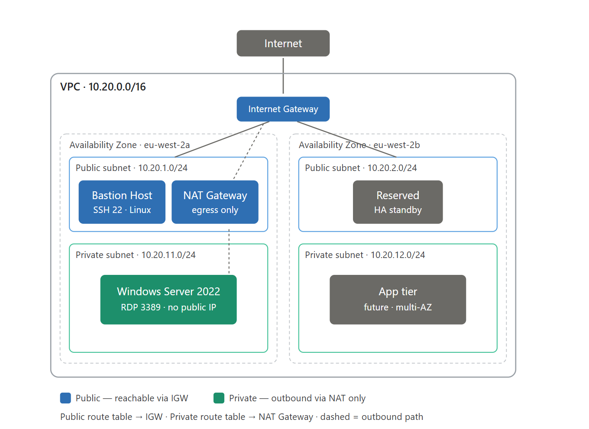
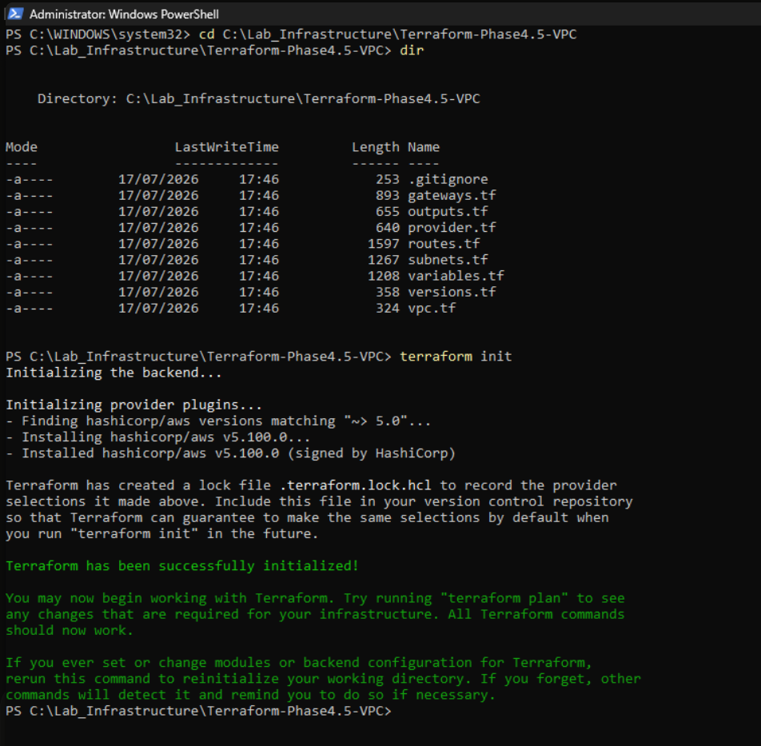
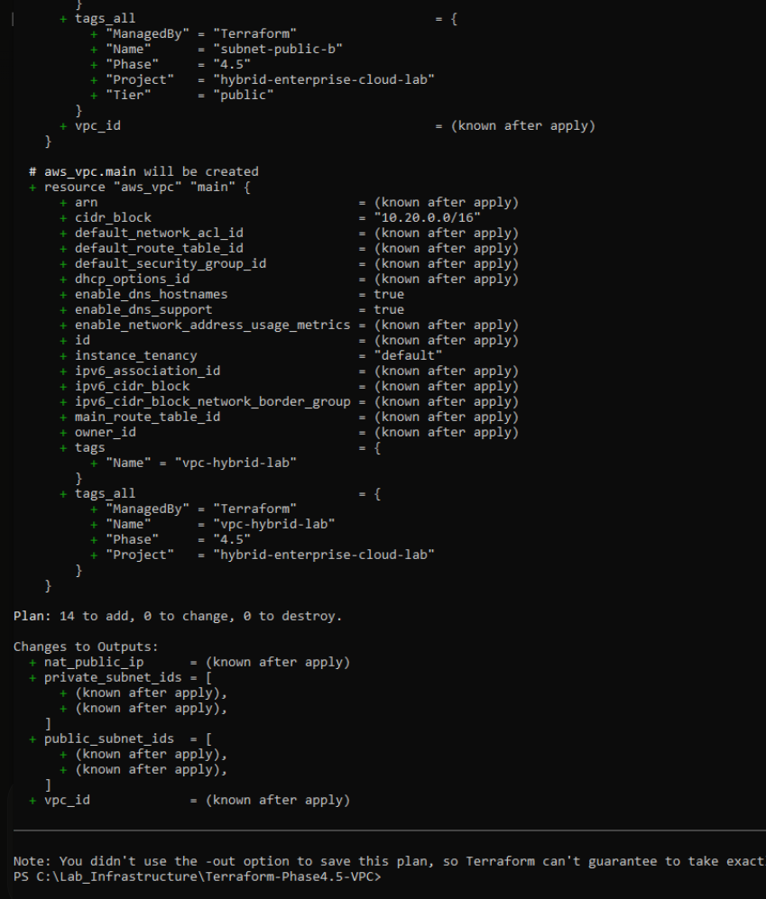
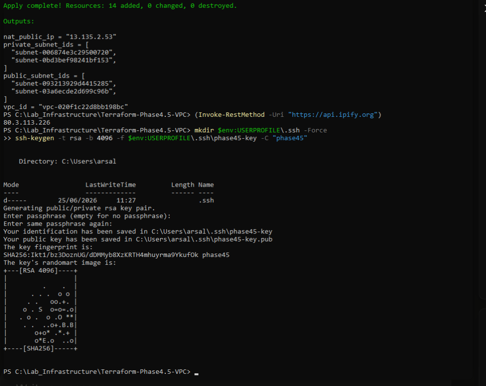
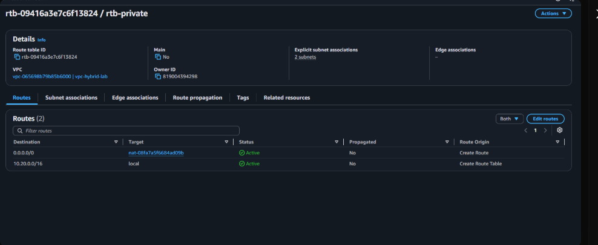
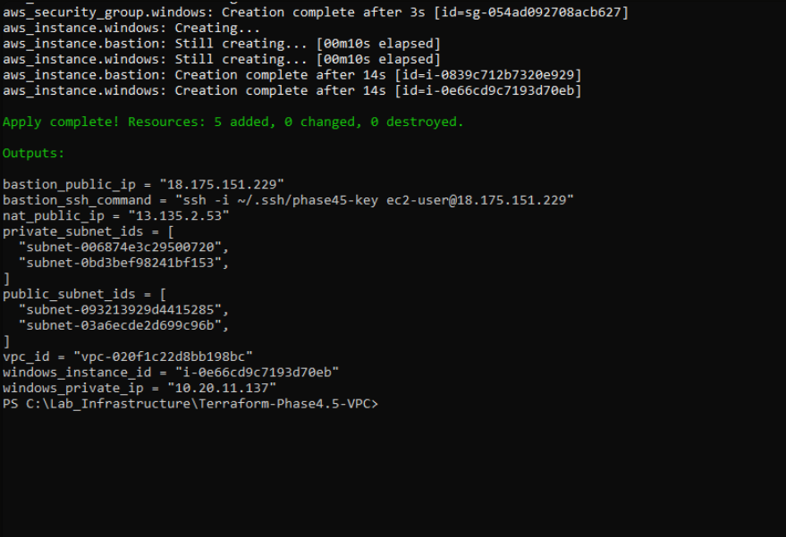
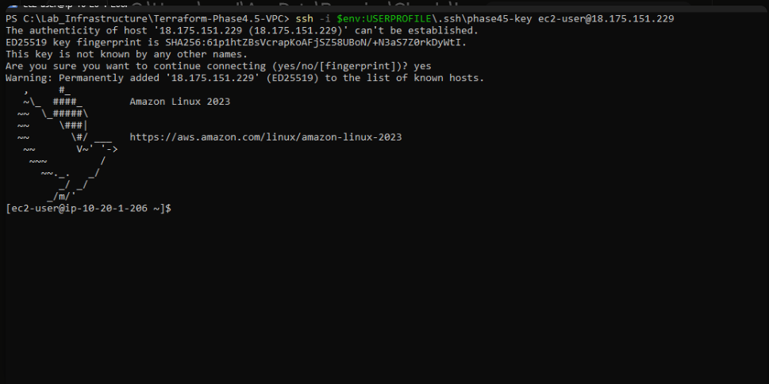
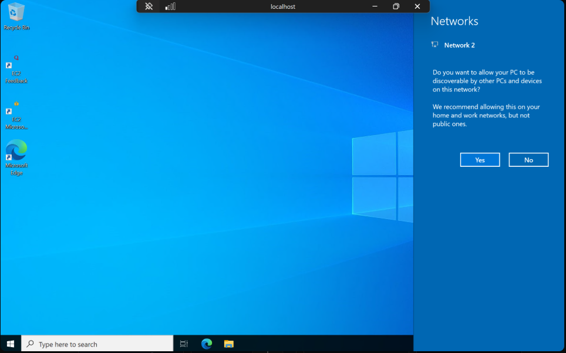

# Phase 4.5 — AWS VPC, Bastion Host & Private Windows Server (Terraform)

**Project:** Hybrid Enterprise & Multi-Cloud Automation Lab
**Region:** `eu-west-2` (London) · **AWS Account:** `819004394298`
**Tooling:** Terraform + AWS CLI on a Windows host, authenticated via a named CLI profile (`arsalan-lab`)
**Status:** ✅ Designed, built as code, verified end-to-end (RDP into a private server through a bastion), then destroyed for cost control. 100% reproducible from code.

> **How to use this page.** This is a complete study document. **Parts 1–2** teach the concepts from
> first principles. **Part 3** is the design. **Part 4** explains the code. **Part 5** is the full
> illustrated build story with every screenshot. **Parts 6–12** cover traffic flow, security analysis,
> rationale, troubleshooting, cost, interview answers and a glossary.

---

## Contents
1. Foundations — the concepts from zero
2. Infrastructure as Code & Terraform
3. This build's architecture
4. The code, file by file
5. **Development walkthrough (with all screenshots)**
6. How traffic actually flows
7. Security analysis (the four questions)
8. Design rationale & trade-offs
9. Gotchas & troubleshooting
10. Rebuild / tear down & cost
11. Interview questions & model answers
12. Glossary

---

## Part 1 — Foundations (the concepts, from zero)

### 1.1 What is a VPC?
A **VPC (Virtual Private Cloud)** is your own private, logically-isolated network *inside* AWS — a
fenced plot of land with a building on it. Everything you run lives inside; nothing external gets in
unless you explicitly allow it. Two customers' VPCs cannot see each other. It is the cloud equivalent
of the isolated host-only network used on the on-prem side of this lab.

### 1.2 IP addressing and CIDR (why `10.20.0.0/16`)
Every machine needs an **IP address** (e.g. `10.20.11.137`). A network is a **CIDR block** written as
`base/prefix`:

- The **prefix** (`/16`, `/24`) says how many bits are fixed as the "network" part; the rest are free
  for hosts.
- `10.20.0.0/16` fixes 16 bits (`10.20`) → **2¹⁶ = 65,536** addresses.
- `10.20.1.0/24` fixes 24 bits → **2⁸ = 256** addresses.

**Subnetting** carves the big VPC range into smaller subnet ranges. We split the `/16` into four
`/24`s. AWS reserves **5 addresses per subnet**, so a `/24` gives **251 usable** IPs.

> We chose `10.20.x` (not the common `10.0.x`) so this network never **overlaps** the on-prem lab —
> overlapping ranges can't be joined later by VPN/peering. *Design address space with future
> connectivity in mind.*

### 1.3 Subnets: public vs private
A **subnet** is a slice of the VPC in one Availability Zone. Nothing is intrinsically public or
private — it depends **entirely on the route table**: a **public** subnet has a route to the Internet
Gateway; a **private** subnet does not (only, at most, an outbound route via a NAT).

### 1.4 Route tables (the single most important concept)
A **route table** maps *"traffic for range X → target Y."* AWS picks the **most specific match**
(longest-prefix):

| Destination | Target | Meaning |
|---|---|---|
| `10.20.0.0/16` | `local` | "Inside the VPC — deliver directly." Automatic; can't be removed. |
| `0.0.0.0/0` | IGW **or** NAT | "The whole internet — send here." The **default route**. |

Whether that default route points at the **IGW** (public) or the **NAT** (private) is *literally what
makes a subnet public or private.* **The absence of an IGW route is the security boundary.**

### 1.5 Internet Gateway (IGW)
A highly-available component attached to the VPC — the single door to the public internet. It also
performs **1:1 NAT** for instances that have a public IP (private IP ⇄ public IP). Only subnets whose
route table points `0.0.0.0/0` at the IGW can use it.

### 1.6 NAT Gateway (outbound-only)
Lets **private** instances reach the internet **outbound only** (updates, agents) while blocking
inbound-initiated connections. It lives in a *public* subnet with a fixed **Elastic IP**. On outbound
traffic it rewrites the **source** address to its own public IP (**source NAT/SNAT**) and remembers
the connection so replies return; the outside world never sees the private instance and cannot start a
connection inward. A one-way outbound valve — the cloud twin of a home router's NAT.

### 1.7 Availability Zones & Regions
A **Region** (`eu-west-2`, London) contains multiple **Availability Zones (AZs)** — physically
separate data centres. Spreading subnets across **two AZs** removes a single point of failure.

### 1.8 Security groups (instance firewalls)
A **security group (SG)** is a firewall on an instance's network interface: **deny-by-default**,
**allow-only** (no deny rules), **stateful** (replies auto-allowed), and **referenceable** (a rule's
source can be *another SG*). We use the last property so the Windows SG allows RDP **from the bastion's
SG**, not from any IP.

> **Advanced — NACLs.** A **Network ACL** is a *subnet-level*, **stateless** firewall with ordered
> allow *and* deny rules (you must permit both directions). We keep the default allow-all NACL and
> filter with SGs. The SG (stateful, instance-level) vs NACL (stateless, subnet-level) distinction is
> a common interview question.

### 1.9 The bastion host pattern
A **bastion / jump host** is a single hardened, monitored machine that is the *only* way to reach
private servers. Expose **one** locked-down box (key-only SSH, restricted source IP) instead of every
server's management port — shrinking the attack surface to one watchable door.

### 1.10 SSH keys (asymmetric cryptography)
A **key pair**: a **public key** (a lock placed on the server) and a **private key** (kept on you). At
login the server proves you hold the private key without it ever being sent — far stronger than
passwords. The bastion accepts **key-based auth only**.

### 1.11 SSH tunnelling / port forwarding
The Windows server has no public IP, so we use **SSH local port forwarding**:
`ssh -L 13389:10.20.11.137:3389 ec2-user@<bastion>` = "open port 13389 on my laptop; carry anything
sent there through SSH to the bastion, which connects onward to the Windows RDP port." We point Remote
Desktop at `localhost:13389`; it emerges inside the VPC. The Windows RDP port is **never** exposed to
the internet.

### 1.12 EC2, AMIs & the Windows password flow
- **EC2** = virtual servers ("instances"). **AMI** = the OS template they boot from (we look up the
  newest official images at build time). **`t3.micro`** = a small Free-Tier size (Free Tier gives 750
  Linux hrs **and** 750 Windows hrs separately, so both machines fit).
- **Windows password flow:** at first boot EC2 encrypts a random Administrator password with the key
  pair's **public** key; you decrypt it locally with your **private** key
  (`aws ec2 get-password-data --priv-launch-key`). It never travels in the clear. (AWS decryption
  needs the private key in **PEM/RSA** format — see Part 9.)

---

## Part 2 — Infrastructure as Code & Terraform

- **Declarative vs imperative:** you describe the desired end state; Terraform works out the steps.
- **Core pieces:** *provider* (AWS API plugin) · *resource* (a thing to create) · *data source* (a
  read-only lookup — we use it for AMIs) · *variable* (input) · *output* (printed value) · *state file*
  (`terraform.tfstate`, its record of reality — **never commit; it can hold secrets**).
- **Lifecycle:** `init` (download provider) → `plan` (dry-run review) → `apply` (build) → `destroy`
  (remove). `plan` before `apply` is *review-before-execute*.
- **Idempotency & dependency graph:** the same code always converges on the same result (so we can
  destroy nightly and rebuild identically). Terraform orders work by references (a subnet references
  the VPC's id), and we add `depends_on` where there's no natural reference (the NAT depends on the
  IGW) — *explicit-over-implicit*.

---

## Part 3 — This build's architecture



| Component | Value / setting | Why |
|---|---|---|
| **VPC** | `10.20.0.0/16`, DNS enabled | Isolated private network |
| **Public subnet A** | `10.20.1.0/24`, `eu-west-2a` | Holds bastion + NAT; routes to IGW |
| **Public subnet B** | `10.20.2.0/24`, `eu-west-2b` | Multi-AZ capacity |
| **Private subnet A** | `10.20.11.0/24`, `eu-west-2a` | Holds the Windows server; NAT only |
| **Private subnet B** | `10.20.12.0/24`, `eu-west-2b` | Multi-AZ capacity |
| **Internet Gateway** | attached to VPC | The one internet door for public subnets |
| **NAT Gateway + EIP** | public subnet A | Outbound-only internet for private subnets |
| **Public route table** | `0.0.0.0/0 → IGW` | Makes public subnets public |
| **Private route table** | `0.0.0.0/0 → NAT` | Outbound-only; **no IGW route** |
| **Bastion** | Amazon Linux 2023, `t3.micro`, public subnet, public IP | Single hardened entry point |
| **Windows server** | Windows Server 2022, `t3.micro`, private subnet, **no public IP** | The protected target |
| **Bastion SG** | inbound SSH(22) from **my IP /32** | Least-privilege admin access |
| **Windows SG** | inbound RDP(3389) from **bastion SG** | No internet path to the server |

**Total: 19 resources** — 14 network (1 VPC, 4 subnets, 1 IGW, 1 EIP, 1 NAT, 2 route tables,
4 associations) + 5 compute (1 key pair, 2 SGs, 2 instances).

---

## Part 4 — The code, file by file

| File | Represents | Key arguments |
|---|---|---|
| `versions.tf` | Tool + plugin versions | AWS provider `~> 5.0` |
| `provider.tf` | How to reach AWS | region, `profile = "arsalan-lab"`, `default_tags` |
| `variables*.tf` / `terraform.tfvars` | Inputs (tfvars git-ignored) | CIDRs, AZs, `my_ip_cidr`, `instance_type` |
| `vpc.tf` | The building | `aws_vpc`, DNS enabled |
| `subnets.tf` | The rooms | 4 × `aws_subnet`; public set `map_public_ip_on_launch` |
| `gateways.tf` | The doors | `aws_internet_gateway`, `aws_eip`, `aws_nat_gateway` (`depends_on` IGW) |
| `routes.tf` | The signs | 2 × `aws_route_table` + 4 × `aws_route_table_association` |
| `keypair.tf` | SSH trust | `aws_key_pair` (public key only) |
| `amis.tf` | OS image lookups | 2 × `data "aws_ami"` |
| `security-groups.tf` | The door locks | `bastion-sg`, `windows-sg` |
| `bastion.tf` / `windows.tf` | The machines | 2 × `aws_instance` |
| `outputs*.tf` | Handy values | IDs, IPs, ready-made SSH command |

---

## Part 5 — Development walkthrough (the full illustrated story)

This is the build in the order it happened, with every screenshot and what it proves.

### Step 0 — Foundations (Phase 1.5)
Created the AWS account; secured **root** with MFA and **no root access keys**; created a
least-privilege IAM user (`arsalan-admin`) with its own MFA and a CLI key; installed Terraform + AWS
CLI; configured the `arsalan-lab` profile; verified with `aws sts get-caller-identity` (correct
account, `user/arsalan-admin`, not root).

### Step 1 — Initialise the project
After writing the network Terraform, `terraform init` downloads the AWS provider plugin (the
translator between Terraform and AWS) and writes a lock file pinning its version.



*Shows: "Terraform has been successfully initialized!" and the `.tf` files in the folder. This is the one-time setup per project.*

### Step 2 — Review the plan (review-before-execute)
`terraform plan` is a dry run — it prints exactly what it *would* build and creates nothing. This is
the habit that makes IaC safe.



*Shows: `Plan: 14 to add, 0 to change, 0 to destroy`, and the `aws_vpc` with `cidr_block "10.20.0.0/16"`. 14 = 1 VPC + 4 subnets + 1 IGW + 1 EIP + 1 NAT + 2 route tables + 4 associations.*

### Step 3 — Build the network
`terraform apply` makes reality match the code. In ~2 minutes the whole network exists.



*Shows: `Apply complete! Resources: 14 added` with the NAT public IP and the subnet/VPC IDs. A real private network, built entirely from code.*

### Step 4 — Verify the security boundary (the key proof)
We don't trust the green tick — we check the thing that actually matters: that the **private** subnet
routes internet traffic to the **NAT**, and has **no route to the Internet Gateway**.



*Shows: `rtb-private` routes — `0.0.0.0/0 → nat-08fa…` and `10.20.0.0/16 → local`. The missing IGW route **is** the security boundary: nothing external can reach these subnets. Compare with the public route table, which points `0.0.0.0/0` at the IGW.*

### Step 5 — Add the machines
On Day 2 the network rebuilt identically from code (~90 s — proof of idempotency), then we added the
compute layer: the key pair, the two security groups, the bastion and the private Windows server.



*Shows: `Apply complete! Resources: 5 added`, with `bastion_public_ip` and `windows_private_ip = 10.20.11.137`. Note the Windows box has **only** a private IP — no public address anywhere.*

### Step 6 — Enter through the bastion
SSH into the bastion succeeds only because two things match: my **IP** is on its allow-list *and* my
**private key** fits the lock.



*Shows: the Amazon Linux 2023 banner and `[ec2-user@ip-10-20-1-206 ~]$`. The hostname `10-20-1-206` is the bastion's private IP inside the public subnet. The single hardened door works.*

### Step 7 — Reach the private server (the payoff)
From the bastion we opened an SSH tunnel to the Windows server's private IP on RDP, retrieved and
decrypted its Administrator password with the private key, and RDP'd in via `localhost:13389`.



*Shows: the desktop of the **private** Windows Server 2022 — a machine with no public IP, reachable only by tunnelling through the bastion. This proves the entire security design end to end.*

After verification we ran `terraform destroy` to remove all 19 resources and stop billing.

---

## Part 6 — How traffic actually flows

**Admin inbound (me → private server):** laptop → SSH to bastion public IP (SG allows my /32 + my key
only) → forward a local port to `windows:3389` → bastion opens RDP to the Windows box (its SG allows
RDP from the bastion SG only) → Remote Desktop on `localhost:13389` controls it. Nothing on the
Windows box is ever reachable from the open internet.

**Private outbound (server → internet):** Windows box → default route `0.0.0.0/0 → NAT` → NAT rewrites
source to its Elastic IP and forwards via the IGW → replies mapped back. **New inbound** connections
can't be started this way.

**Why inbound-from-internet is impossible for the server:** it has no public IP and its route table
has no route to the IGW — there is simply no path.

---

## Part 7 — Security analysis (the four questions)

**Bastion:** reachable only by my IP, on SSH, with my key. If compromised, an attacker still needs my
private key and can reach only what the bastion can (the server's RDP) — not the whole VPC. If it
fails, I lose admin access (rebuild from code) but nothing is exposed.

**Windows server:** reachable only from the bastion, on RDP. No inbound internet path; outbound only
via NAT. If it fails, rebuild from code.

**NAT Gateway:** if it fails, private instances lose outbound internet but stay protected — a safe
failure mode. **Internet Gateway:** the one internet door; detaching it darkens the VPC (safe-fail).

**Attack surface:** exactly **two** things face the internet — the IGW (a managed AWS service) and the
bastion's SSH port, locked to a single IP. Everything else is private.

---

## Part 8 — Design rationale & trade-offs

- **Custom VPC, not the default** — the default VPC is flat and all-public; a custom one gives explicit
  boundary and routing control.
- **Server has no public IP** — removes the entire internet-facing attack surface.
- **Linux bastion (not Windows)** — mirrors the project's SSH-hardening approach *and* keeps both
  machines in Free Tier (separate Linux/Windows allowances). Trade-off: reaching Windows needs an
  SSH-tunnel, not a direct RDP jump.
- **Single NAT Gateway** — one NAT instead of one-per-AZ to control cost. **Documented risk:** an AZ-a
  failure would cut AZ-b's outbound internet. Acceptable for a lab; production uses one NAT per AZ.

**Principles demonstrated:** least privilege · defence in depth · single hardened entry point ·
no insecure defaults · explicit-over-implicit · reproducibility (plan → apply → destroy).

---

## Part 9 — Gotchas & troubleshooting (things we actually hit)

- **"Unable to decrypt password data":** modern `ssh-keygen` writes **OpenSSH** keys, but AWS Windows
  password decryption needs **PEM (RSA)**. Fix: `ssh-keygen -p -m PEM -f <key>` (or generate with
  `-m PEM`).
- **"name cannot begin with sg-":** an `aws_security_group` `name` can't start with `sg-` (reserved).
  Used `bastion-sg` / `windows-sg`.
- **RDP "can't connect":** wrong tunnel port (`13389`, not `13398`), or the `ssh -L …` window was
  closed — that session *is* the pipe and must stay open.
- **Login rejected:** use `.\Administrator` — the leading `.\` forces the local account on the remote
  server, not your Microsoft/domain account.

---

## Part 10 — Rebuild / tear down & cost

```powershell
cd C:\Lab_Infrastructure\Terraform-Phase4.5-VPC
terraform init      # once per machine
terraform plan      # review (builds nothing)
terraform apply     # "yes" — builds all 19 resources (~2 min)
terraform destroy   # "yes" — removes everything, stops billing
```

**Cost:** instances are Free-Tier `t3.micro`. The **NAT Gateway is not free** (~$0.045/hr + data), so
always `destroy` when finished. This build was destroyed after verification.

---

## Part 11 — Interview questions & model answers

**Securely administer a server with no public internet access?** It sits in a private subnet with no
public IP and no IGW route, so nothing external can reach it. I go through a bastion that only accepts
SSH from my IP with key-based auth, then tunnel RDP through that SSH connection. All access funnels
through one hardened entry point — defence in depth plus least privilege.

**What makes a subnet public or private?** Its route table. Public routes `0.0.0.0/0` to the IGW;
private has no such route and only routes outbound via a NAT. The absence of the IGW route is the
boundary.

**IGW vs NAT Gateway?** The IGW is the two-way internet door and does 1:1 NAT for public-IP instances.
The NAT gives private instances outbound-only access via source NAT; nothing can initiate inward.

**Security group vs NACL?** SGs are stateful, instance-level, allow-only. NACLs are stateless,
subnet-level, with ordered allow/deny rules. I filter with SGs and leave the default allow-all NACL.

**Why one NAT and the trade-off?** Cost — a NAT bills per hour. One NAT means an AZ-a failure cuts
AZ-b's egress; production uses one per AZ. I documented the trade-off deliberately.

**Why Infrastructure as Code?** Declarative, version-controlled, idempotent — plan before apply,
destroy and rebuild identically to control cost, reproducible with no drift.

**How did you keep it least-privilege?** IAM user not root, MFA everywhere, SSH from my IP only, RDP
from the bastion SG only, secrets kept out of source control.

---

## Part 12 — Glossary

**VPC** isolated virtual network · **CIDR** `base/prefix` range (`/16`=65,536, `/24`=256) · **Subnet**
a VPC slice in one AZ, public/private by route table · **Route table** destination→target rules ·
**IGW** the VPC's internet door · **NAT Gateway** outbound-only internet for private subnets ·
**Elastic IP** a static public IPv4 · **AZ** an isolated data centre in a region · **Security Group**
stateful instance firewall · **NACL** stateless subnet firewall · **Bastion** single hardened jump box
· **EC2 / AMI / instance type** virtual server / OS template / size · **SSH key pair** public (server)
+ private (you) · **SSH `-L`** local port forwarding through the bastion · **Terraform** declarative
IaC · **Idempotent** same code → same result.
