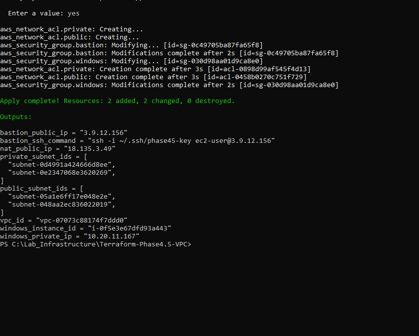
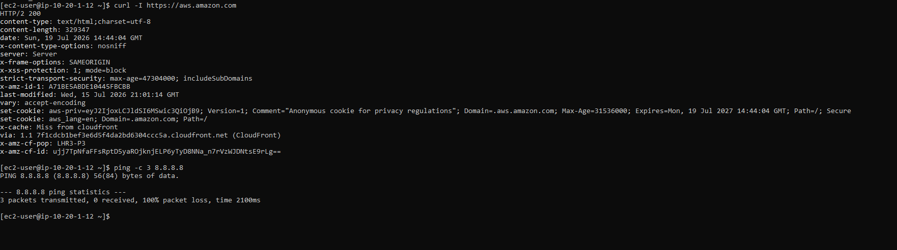
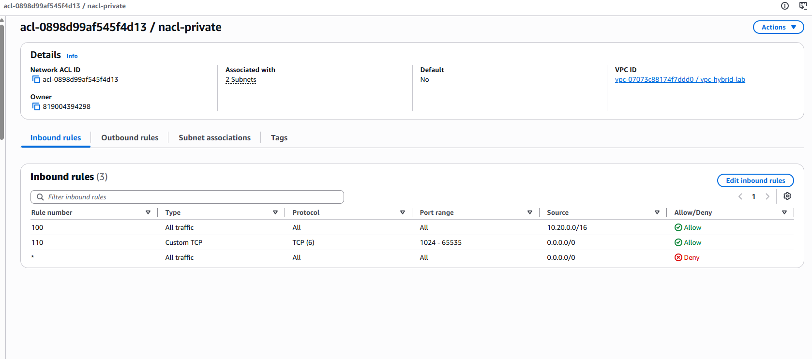
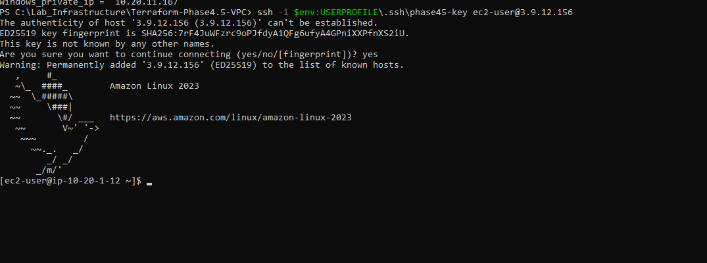

# Phase 4.6 — Security Hardening: Security Groups, Network ACLs & IAM Roles

## Concepts & Theory (read this first)

> This section is here so that whenever you come back to this page you can re-learn the *ideas*
> before the technical steps. It assumes no prior knowledge and defines every term. Read it top to
> bottom; by the end you should be able to explain what this phase does and why — out loud, without
> notes.

---

### 0. What this phase is, in one line
Phase 4.6 takes the network we built in 4.5 and **hardens its security** using three layers:
tighter **Security Groups**, new **Network ACLs**, and **IAM roles**. Together these are the textbook
example of **defence in depth** — several independent safety layers, so that one failure never means
a break-in.

---

### 1. Where we came from — what Phase 4.5 already secured
Before adding anything, it helps to see that 4.5 was *already* a layered security build. It secured
**four** things:

1. **Network isolation (the strongest control — and it isn't a firewall).**
   *How:* the Windows server sits in a **private subnet** with **no public IP**, and that subnet's
   route table points at the NAT, **not** the Internet Gateway.
   *Why:* if there is **no route** from the internet to a machine, an attacker cannot even address it.
   The *absence of a path* is stronger than any block rule.

2. **The bastion pattern (one door instead of many).**
   *How:* a single small Linux "bastion" box is the only public-facing admin entry; the real server
   stays private behind it.
   *Why:* it shrinks the **attack surface** to one hardened, monitored host.

3. **Security Groups locked on the way IN (ingress).**
   *How:* the bastion only accepts SSH **from my IP**; the Windows box only accepts RDP **from the
   bastion's security group**.
   *Why:* **least privilege** — only I, from one address, can knock on the bastion, and only the
   bastion can reach the server.

4. **Identity hygiene.**
   *How:* key-based SSH (no passwords) and an **IAM user with MFA instead of root**.
   *Why:* nothing guessable, and the all-powerful root account isn't used for daily work.

---

### 2. Why 4.6 exists — the gaps 4.5 left open
4.5 was solid but had three honest weaknesses. **This phase fixes each one:**

| Gap in 4.5 | Why it's a weakness | 4.6 fix |
|---|---|---|
| **Egress was wide open** (both SGs allowed *all* outbound) | If a machine is ever compromised, unrestricted outbound is how malware "phones home" or steals data | **Least-privilege egress** — allow only what's needed (80/443 for updates + traffic inside the VPC) |
| **Only one firewall layer**, and it can only *allow* | A single misconfigured SG has nothing behind it; SGs can't *deny* a specific bad IP | Add **Network ACLs** — a second, subnet-level layer that can **deny** |
| **The machine had no safe identity** | To use another AWS service (e.g. S3) you'd have to copy secret keys onto the box — and keys leak | Add an **IAM role** — temporary, auto-rotating credentials, **no stored secret** |

**One-sentence summary of the whole progression:**
> *In 4.5 I controlled who could get **in**. In 4.6 I restrict what the machines can reach **out** to,
> add a second firewall layer (NACLs) for defence in depth, and give the machines an IAM role so they
> use temporary credentials instead of stored keys.*

---

### 3. What Terraform actually is (because it's easy to picture wrong)
Terraform is **not** a file and **not** part of AWS. It is a **tool installed on your PC** — think of
it as a **building contractor**:

- **Your `.tf` files** = the **blueprint**. You write, in code, exactly what should exist ("a VPC with
  this range, four subnets, a bastion here…"). *You* author this; you don't "configure AWS by opening
  Terraform."
- **Terraform** = the **contractor** that reads the blueprint and builds it.
- **AWS** = the **plot of land** it gets built on.
- **State file (`terraform.tfstate`)** = the contractor's **logbook** of what's been built so far.

The lifecycle:
- `terraform plan` — the contractor says *"here's what I'm about to build/change"* (a dry run; builds nothing).
- `terraform apply` — the contractor **actually builds it** in AWS.
- `terraform destroy` — the contractor **cleanly demolishes it**.

**Why it matters:** because the infrastructure is written down as code, you can destroy it at night,
rebuild it identically in the morning with one command, review it, and version it — impossible for
someone just clicking in the console.

---

### 4. Security Group — definition and how it behaves
**Definition:** a **security group (SG)** is a firewall attached to an individual machine's network
interface.

- **Level:** the **instance** (per-machine).
- **Rules:** **allow only** (you cannot write a "deny" rule).
- **Stateful:** it **remembers** connections. If it allowed a request *in*, it automatically allows
  the reply *out* — you never write return rules.
- **Analogy:** the **lock on an individual office door**, with a memory of who it let in.

---

### 5. Network ACL (NACL) — definition and how it behaves
**Definition:** a **Network ACL** is a firewall attached to a **subnet** (a whole section of the
network).

- **Level:** the **subnet** (guards everything inside it).
- **Rules:** **allow *and* deny**, evaluated in **number order — first match wins**.
- **Stateless:** it has **no memory**. It judges every packet on its own, in or out.
- **Analogy:** a **guard at the entrance to the whole floor**, checking every packet against a
  numbered checklist, with no memory of what came before.

---

### 6. The idea that trips everyone up — stateful vs stateless & "ephemeral ports"
This is the single most important concept in this phase, so read it slowly.

- **Stateful (Security Group):** remembers connections → return traffic is allowed automatically.
- **Stateless (NACL):** no memory → **you must allow the return traffic yourself.**

And return traffic comes back on a **random high port** called an **ephemeral port** (range
**1024–65535**). Worked example — the Windows server downloads an update:

```
Outbound request:  FROM windows:49152 (a random ephemeral port)  TO  update-server:443
Inbound reply:     FROM update-server:443                        TO  windows:49152
```

- With a **Security Group** you only wrote "allow outbound 443." Being stateful, it remembers the
  request and lets the reply back in automatically. Done.
- With a **NACL** (stateless), your outbound rule allows port 443 — but the **reply arrives inbound on
  port 49152**, and the NACL has no memory of the request. So unless you *also* add an inbound rule
  **"allow ports 1024–65535"**, the download silently hangs.

> **Interview line:** *"Why did traffic break after adding a NACL? Because it's stateless — I forgot
> to allow the ephemeral return ports."*

**The takeaway phrase:** **SG = narrow + has memory; NACL = wide + no memory, so you hand-write the
return rules.**

---

### 7. Defence in depth — why have two firewalls at all?
Two independent layers mean one mistake isn't fatal:
- If you accidentally open a **security group** too wide, the **NACL still blocks** it at the subnet edge.
- If you need to **hard-block a known-bad IP**, only the **NACL can deny** it.
- An attacker must defeat **both** a subnet-level guard *and* a machine-level lock.

Stacked with the 4.5 network isolation, the layers are: **no route in (isolation) → subnet guard
(NACL) → machine lock (SG).** That stack *is* defence in depth.

---

### 8. Ingress vs egress — and why we now restrict egress
- **Ingress** = traffic coming **in** to a machine. **Egress** = traffic going **out**.
- In 4.5 we tightly controlled ingress but left egress "allow all."
- **Least-privilege egress** means only letting a machine reach out to what it genuinely needs
  (updates on 80/443, and other machines inside the VPC). *Why:* it **contains the blast radius** — if
  a machine is compromised, it can't freely send data anywhere.

---

### 9. IAM Roles (coming in Day 2) — identity for a machine
**Definition:** an **IAM role** is a set of permissions a machine can **temporarily assume** — it
gives the machine an identity so it can call other AWS services *without any stored password or key*.

- **IAM user** = a permanent identity for a *person* (has long-lived credentials).
- **IAM role** = a temporary identity a *machine* (or service) assumes on demand.
- **How it works:** the instance is handed **short-lived, auto-rotating credentials** through its
  internal metadata; nothing secret is ever written to disk.
- *Why it's the biggest best practice:* there is **no key to leak**. In this phase the role will grant
  **read-only S3 access** and **SSM Session Manager** (a way to get a shell on the private server with
  no key, no bastion and no open ports).

---

### 10. One-line summaries to test yourself
- **Security Group:** a stateful, instance-level, allow-only firewall.
- **NACL:** a stateless, subnet-level firewall that can allow *and* deny.
- **Ephemeral ports:** the random high ports (1024–65535) that replies come back on — NACLs need an
  explicit rule for them.
- **Defence in depth:** multiple independent security layers so one failure isn't a breach.
- **Least-privilege egress:** only let a machine reach out to what it truly needs.
- **IAM role:** a temporary machine identity — permissions without stored keys.

---

### 11. Glossary
- **Ingress / Egress** — traffic coming in / going out.
- **Security Group (SG)** — stateful, instance-level, allow-only firewall.
- **Network ACL (NACL)** — stateless, subnet-level firewall with ordered allow/deny rules.
- **Stateful / Stateless** — remembers connections / has no memory.
- **Ephemeral port** — a random high source port (1024–65535) used for replies.
- **Defence in depth** — layering independent controls.
- **Least privilege** — grant only the minimum access needed.
- **IAM user / IAM role** — a person's permanent identity / a machine's temporary assumed identity.
- **Instance profile** — the wrapper that attaches an IAM role to an EC2 instance.
- **SSM Session Manager** — AWS service for a keyless, portless shell onto an instance.
- **Terraform** — declarative IaC tool that builds your written blueprint in AWS.

---

## Day 1 — The Network Firewall Layer (Security Groups + Network ACLs)

**Goal of the day:** take the network from 4.5 and add two things — **least-privilege egress** on the
security groups, and a **second, subnet-level firewall (NACLs)** underneath them — then *prove* the
hardening works without breaking legitimate access.

### What actually changed

**1. Security groups — egress tightened (the refinement).**
In 4.5 both machines had "allow all outbound." We replaced that with least-privilege egress:

| Machine | Egress now allows | Why |
|---|---|---|
| Bastion | `443`, `80` to anywhere; `53` (DNS) to the VPC; `3389` to the VPC | Updates/AWS APIs; name resolution; reach the Windows box for the tunnel |
| Windows | `443`, `80` to anywhere; `53` (DNS) to the VPC | Windows Update / AWS APIs; name resolution |

*Ingress was left unchanged (SSH from my IP; RDP from the bastion). And because security groups are
**stateful**, no return rules are written — replies are allowed automatically.*

**2. Network ACLs — a new stateless layer.**
Two custom NACLs, one on the public subnets, one on the private. Because NACLs are **stateless**, each
includes an explicit **ephemeral-ports (1024–65535)** rule so return traffic can get back in. The
automatic final **deny-all** rule blocks any new inbound connection from the internet.

### Step 1 — Apply the hardening



*`Apply complete! Resources: 2 added, 2 changed, 0 destroyed`* — the 2 NACLs added, the 2 security
groups' egress edited **in place**, and **0 destroys**.

> **Lesson banked here:** the first `plan` actually showed `2 to destroy`, because I'd changed the
> security-group **description** — an **immutable** attribute in AWS, so any change forces a full
> destroy-and-recreate. Reverting the description to its original value made it a clean in-place edit.
> *Always read a plan for unexpected `destroy` lines before applying — that's exactly why `plan`
> exists.*

### Step 2 — Prove the least-privilege egress actually restricts traffic



Run from inside the bastion:
- `curl -I https://aws.amazon.com` → **`HTTP/2 200`** — needed DNS (53) to resolve the name and HTTPS
  (443) to connect, both explicitly allowed. ✅
- `ping -c 3 8.8.8.8` → **`100% packet loss`** — ICMP was never permitted, so it's dropped. ❌

Same machine, same internet — one protocol allowed, one denied, purely because of the rules. **That
is least-privilege egress:** the machine can only reach out on exactly the ports permitted.

### Step 3 — Verify the second (NACL) layer and its stateless rules



The private subnets' NACL inbound rules, and why each exists:
- **`100` Allow all from `10.20.0.0/16`** — anything from inside the VPC (lets the bastion's RDP and
  DNS replies in).
- **`110` Allow TCP `1024–65535` from anywhere** — the **ephemeral-ports** rule. It exists *only*
  because a NACL is stateless; it's what lets the Windows server's update **replies** back in. Delete
  it and updates hang, even though the outbound 443 rule is fine.
- **`*` Deny all** — the automatic final rule. With no allow rule for a *new* inbound connection from
  the internet, any such attempt is dropped here. This is the subnet-level guard, a second layer
  beneath the security group.

*Details also confirm `Default: No` (a custom NACL) and `Associated with 2 Subnets` (attached to both
private subnets).*

### Step 4 — Confirm we hardened without locking ourselves out



SSH still lands at the bastion prompt. For this to work the packet had to clear **both** new layers —
the public **NACL** (SSH in from my IP + ephemeral returns out) *and* the tightened bastion **security
group**. Access intact, security improved.

### Day 1 result

Layered defence in depth is now live: **no route in (4.5 isolation) → subnet guard (NACL) → machine
lock (security group)**, with egress restricted to least privilege. Verified working end-to-end, then
`terraform destroy` to stop the NAT billing overnight (the code rebuilds it identically on demand).

**Interview one-liners from today:**
- *"I proved the egress lockdown by showing HTTPS succeeded while ICMP was dropped."*
- *"A NACL is stateless, so I had to add an explicit ephemeral-ports rule for return traffic — a security group handles that automatically."*
- *"Changing a security group's description forces a replace because it's immutable — I caught it in the plan before applying."*
