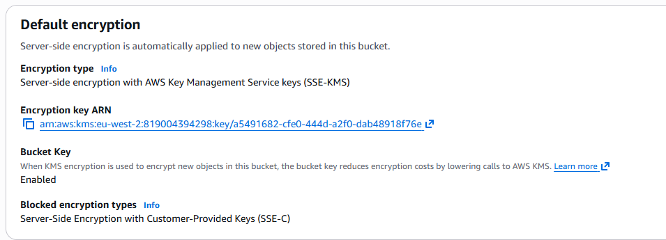
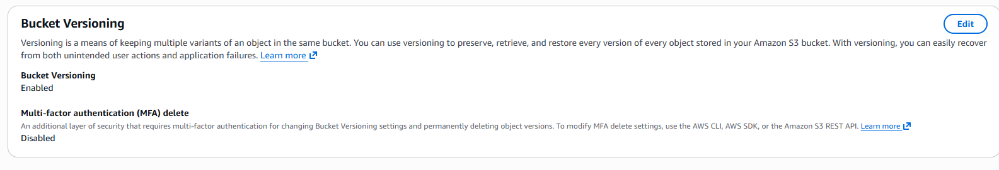
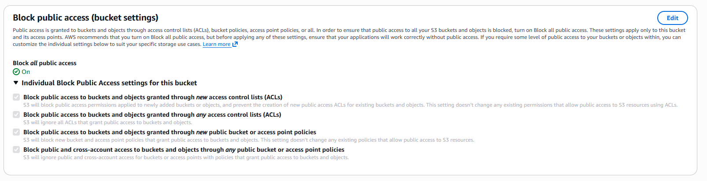

# Phase 4.7 — Secure Storage: S3, KMS Encryption & Lifecycle (Terraform)

## Concepts & Theory (read this first)

> Read this before the technical steps. It assumes no prior knowledge and defines every term. By the
> end you should be able to explain what this phase does and why — out loud, without notes.

---

### 0. What this phase is, in one line
Phase 4.7 creates a **properly secured S3 storage bucket** — locked away from the public, **encrypted
at rest with a key you own and control (KMS)**, versioned, and (Day 2) governed by **lifecycle rules**
that manage cost automatically. It's the **data-security** layer of the project.

---

### 1. Where we came from
- **4.5** built the network (VPC, subnets, bastion, private server).
- **4.6** hardened it (least-privilege firewalls + an IAM role giving the machine a keyless identity).
- **4.7** adds **secure storage**, and ties back to 4.6: the instance's IAM role already has S3 read
  access, so we'll prove it can read from the new bucket using temporary credentials — no keys.

---

### 2. What is S3? (object storage)
**S3 (Simple Storage Service)** is AWS's **object storage**. Definitions:
- **Object** = a whole file plus its metadata (an image, a log, a backup).
- **Bucket** = the named container objects live in.
- **Key** = the object's name/path within the bucket.

It's not a disk you mount (that's *block* storage, like EBS) and not a shared file system (that's
*file* storage, like EFS). You `PUT` and `GET` whole objects over an API. It's effectively unlimited,
very cheap, and extremely durable (designed for 99.999999999% — "eleven nines" — durability).

**Two gotchas:** bucket names are **globally unique across all AWS customers**, and buckets are
**regional**. We'll add a unique suffix to the name to avoid collisions.

---

### 3. Why S3 security is the whole point — Block Public Access
Misconfigured, publicly-readable S3 buckets are the **single most common cause of real-world data
breaches** (leaked customer data, credentials, backups). AWS's answer is **Block Public Access
(BPA)** — a set of **four** switches that, when all on, guarantee the bucket **cannot** be made public,
even if someone later writes a careless policy or ACL. It's a safety net that overrides mistakes.
We turn on **all four**.

---

### 4. Encryption at rest — and who holds the key
**Encryption at rest** = data is stored **scrambled on disk**, so a stolen physical disk is useless
without the key. On S3 you choose *who manages the key* (all are "server-side encryption", SSE):

| Option | Who holds the key | Trade-off |
|---|---|---|
| **SSE-S3** | AWS, invisibly (AES-256) | Simplest; you control nothing |
| **SSE-KMS (customer-managed)** ← our choice | **You**, via a KMS key you create | Full control: key policy, rotation, audit trail |
| **SSE-C** | You supply the key on every request | You manage key material yourself; rarely used |

We use **SSE-KMS with a customer-managed key** — the "elite standard": we own the key, set its policy,
and enable **automatic annual rotation**.

---

### 5. KMS — Key Management Service
**KMS** is AWS's service for creating and controlling encryption keys. Key types:
- **AWS-owned** — invisible, shared, no control.
- **AWS-managed** (e.g. `aws/s3`) — AWS makes/rotates it for you; you can't edit its policy.
- **Customer-managed** ← ours — **you** create it, write its **key policy** (who can use it), enable
  **rotation**, and every use is logged in CloudTrail (an audit trail of who decrypted what).

**Key policy** = the rulebook on the key saying which identities may use it. This is why encryption and
access control work *together*: even if someone reaches the bucket, they can't read the objects unless
the KMS key policy also lets them use the key. **Two locks, not one.**

---

### 6. Envelope encryption — how KMS actually encrypts (the clever bit)
KMS does **not** encrypt your large object directly. Instead:
1. KMS generates a one-time **data key**.
2. That data key encrypts your object.
3. KMS then encrypts the little **data key** with your **master key** and stores it beside the object.
4. To read: AWS asks KMS to decrypt the data key, then uses it to decrypt the object.

This is **envelope encryption** — it lets one small master key protect unlimited large objects
efficiently. Naming it in an interview signals you actually understand KMS.

---

### 7. Bucket policy vs IAM policy (enforcing the rules)
- **IAM policy** = *identity*-based — attached to a user/role, says "this identity may do X."
  (The EC2 role from 4.6 is this kind.)
- **Bucket policy** = *resource*-based — attached to the **bucket**, says "these rules apply to this
  bucket no matter who's asking."

We use a bucket policy to **enforce** security regardless of the caller:
- **Deny any request not over HTTPS** (`aws:SecureTransport = false`) → encryption **in transit**.
- **Deny any upload that isn't encrypted with our KMS key** → guarantees encryption **at rest**.

---

### 8. Versioning
**Versioning** keeps previous copies of an object when it's overwritten or deleted, so mistakes and
malicious deletes are recoverable (a delete just adds a "delete marker"). It's a data-protection
control *and* the foundation for **lifecycle rules** (Day 2), which can expire or archive *old
versions* separately from current ones.

---

### 9. At rest vs in transit (don't mix them up)
- **At rest** = data sitting on disk in S3 → protected by SSE-KMS.
- **In transit** = data moving over the network → protected by HTTPS/TLS (enforced by the bucket
  policy's "deny non-TLS" rule).
A complete design protects **both**.

---

### 10. One-line summaries to test yourself
- **S3:** object storage — whole files in named buckets, retrieved by key.
- **Block Public Access:** four switches guaranteeing the bucket can't be exposed publicly.
- **Encryption at rest:** data stored scrambled on disk; useless if the disk is stolen.
- **SSE-KMS (customer-managed):** encryption using a key you own, control and rotate.
- **Envelope encryption:** a data key encrypts the object; the master key encrypts the data key.
- **Bucket policy:** resource-based rules on the bucket (we deny non-HTTPS and unencrypted uploads).
- **Versioning:** keeps old object versions so overwrites/deletes are recoverable.

---

### 11. Glossary
- **S3 / bucket / object / key** — object-storage service / container / a stored file / its name.
- **Block Public Access (BPA)** — four settings preventing any public exposure.
- **Encryption at rest / in transit** — scrambled on disk / protected over the network (TLS).
- **SSE-S3 / SSE-KMS / SSE-C** — server-side encryption managed by S3 / by KMS / by you.
- **KMS** — Key Management Service; creates and controls encryption keys.
- **Customer-managed key (CMK)** — a KMS key you own, with your own policy and rotation.
- **Key policy** — the rulebook on a KMS key saying who may use it.
- **Envelope encryption** — data key encrypts the object; master key encrypts the data key.
- **Bucket policy** — resource-based access policy attached to a bucket.
- **Versioning** — retaining previous versions of objects.
- **Lifecycle rule** — automatic transition/expiration of objects to manage cost (Day 2).

---

## Day 1 — The Secure Bucket (S3 + Customer-Managed KMS)

**Goal of the day:** create an S3 bucket that is private by default, **encrypted at rest with a KMS
key we own and control**, and versioned — then verify each control in the console.

### What we built

| File | Resource | What it does |
|---|---|---|
| `kms.tf` | `aws_kms_key` + alias | A **customer-managed key** with a key policy and **automatic yearly rotation**. Its policy also grants the 4.6 EC2 role `kms:Decrypt`, so the instance can later read encrypted objects. |
| `s3.tf` | `aws_s3_bucket` | The bucket, named `hybrid-lab-secure-<account-id>` (globally unique). |
| `s3.tf` | `aws_s3_bucket_public_access_block` | **Block Public Access** — all four switches on. |
| `s3.tf` | `aws_s3_bucket_versioning` | Versioning enabled. |
| `s3.tf` | `aws_s3_bucket_server_side_encryption_configuration` | Default **SSE-KMS** encryption using our key (Bucket Key on for cost). |
| `s3.tf` | `aws_s3_bucket_policy` | Denies any request **not over HTTPS** (encryption in transit). |

**Why the KMS key grants the EC2 role Decrypt:** `AmazonS3ReadOnlyAccess` lets the instance *read*
objects, but a KMS-encrypted object *also* needs `kms:Decrypt` on the key. So the bucket **and** the
key must both permit access — two independent locks.

### Step 1 — Apply

`Apply complete!` with outputs `s3_bucket_name = hybrid-lab-secure-819004394298` and the customer-managed
`kms_key_arn`. The whole stack plus the seven new storage resources, from code.

### Step 2 — Encryption at rest, with our own key

Default encryption is **SSE-KMS**, and the **Encryption key ARN matches our `kms_key_arn`** — so it's
*our* key encrypting the data, not AWS's default. Every new object is auto-encrypted (envelope
encryption). **Bucket Key: Enabled** trims KMS request costs.

### Step 3 — Versioning

**Bucket Versioning: Enabled** — old versions are retained, so an accidental overwrite or delete is
recoverable. It's also the foundation for Day 2's lifecycle rules.

### Step 4 — Block Public Access

**Block *all* public access: On**, with all four individual settings enabled. The bucket cannot be made
public — even by a careless future policy or ACL. This is the control that prevents the classic "public
S3 bucket" data breach.

### Day 1 result

A private-by-default, versioned bucket, encrypted at rest with a **customer-managed KMS key** (rotation
on) and enforcing HTTPS in transit. Verified in the console, then `terraform destroy` (the KMS key
enters a 7-day deletion window — an AWS safety feature — rather than deleting instantly).

**Interview one-liners from today:**
- *"Block Public Access is the safety net that stops the classic public-bucket breach — it overrides any careless policy."*
- *"I used SSE-KMS with a customer-managed key so I control the key policy and rotation, not just 'encryption on'."*
- *"Reading a KMS-encrypted object needs both S3 read permission and kms:Decrypt — the bucket and the key are two separate locks."*
- *"KMS uses envelope encryption: a data key encrypts the object, and the master key encrypts the data key."*
