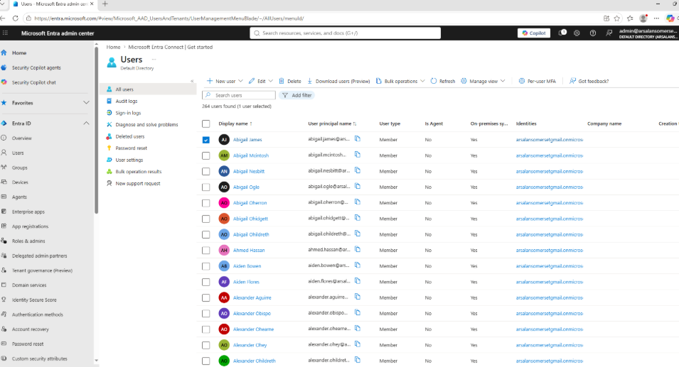
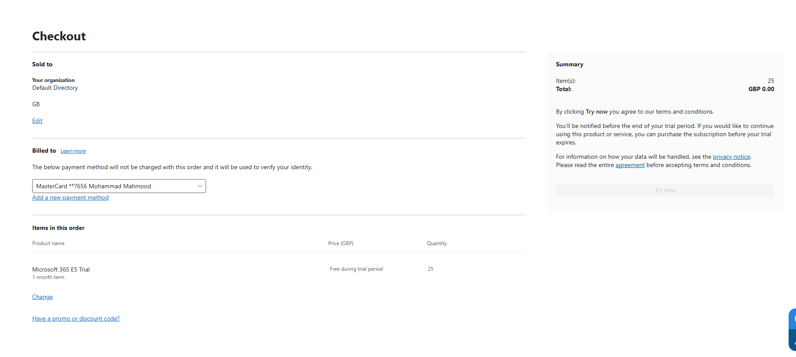
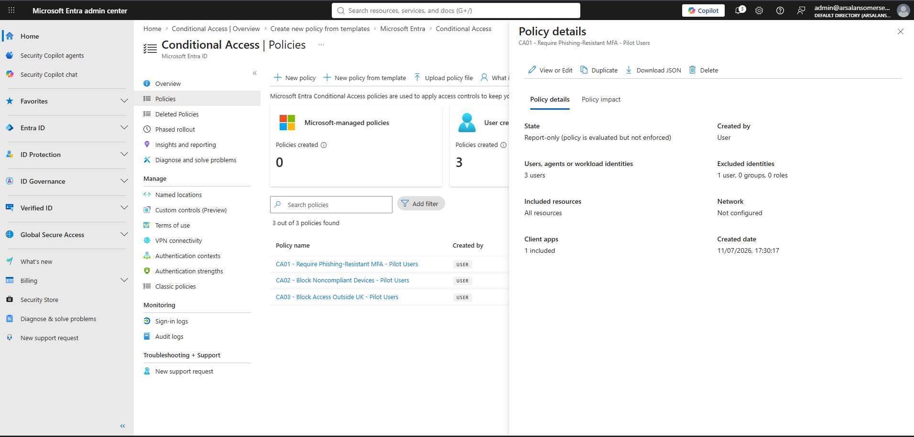
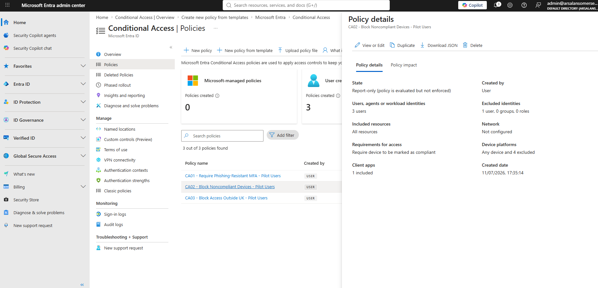
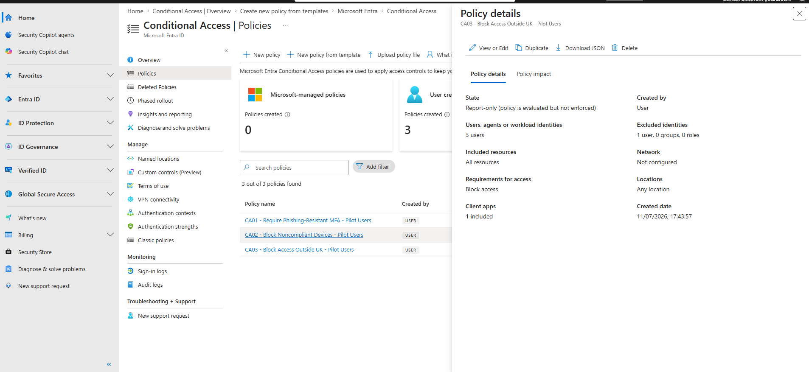
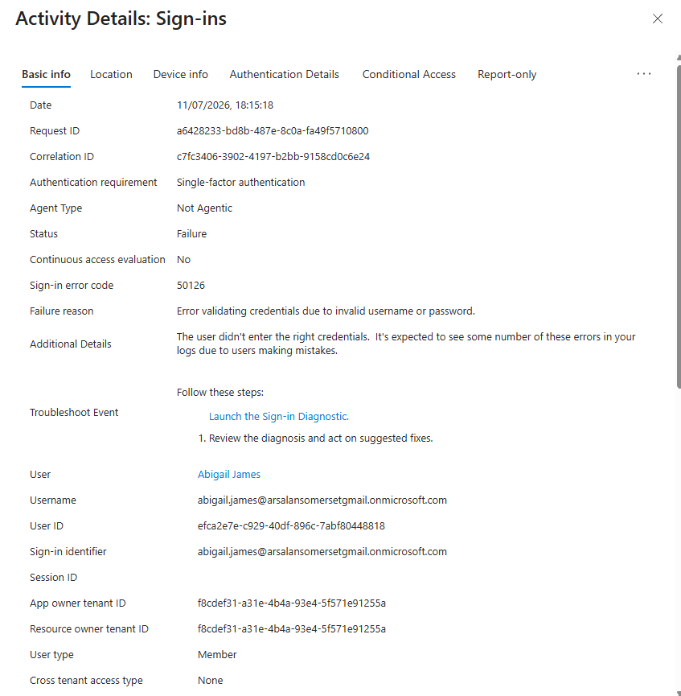
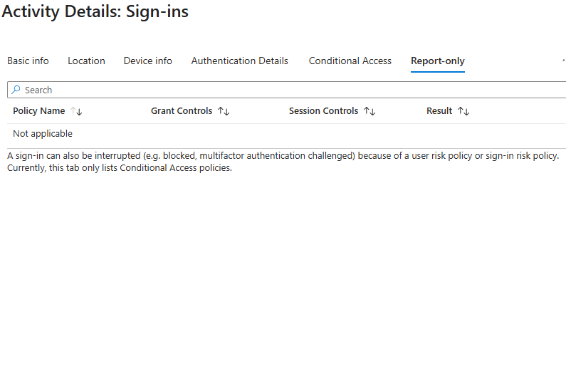
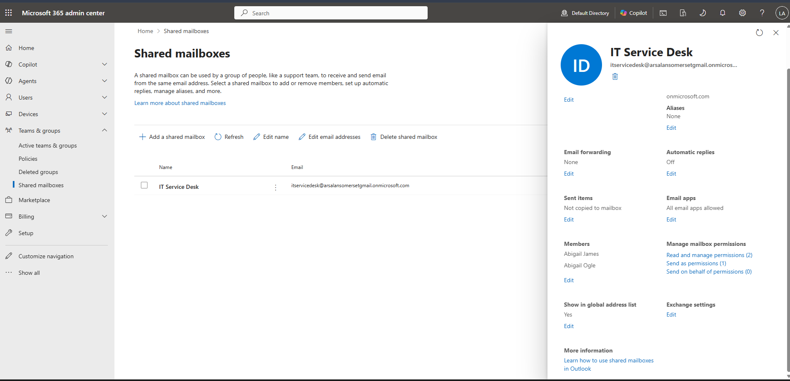

# Phase 4.1 – Entra Connect Directory Bridging

## Objective
Establish hybrid identity by synchronising the on-premises Active Directory domain 
(corp.infralab.local) into Microsoft Entra ID using Microsoft Entra Connect Sync, so 
that on-prem and cloud identities share a single authoritative source — creating the 
foundation for Zero Trust Conditional Access, Intune device compliance, and Azure 
Virtual Desktop later in this phase.

## Architecture & design decisions

### Sync scope: Administration OU excluded
The Entra Connect sync account effectively holds Replicating Directory Changes rights 
over anything it's scoped to sync — functionally equivalent to a Domain Controller. To 
avoid creating a blast-radius bridge between the on-prem privileged tier and the cloud 
plane, the Administration OU (Tier 0 admin accounts) is explicitly excluded from the 
sync scope via OU filtering. Only the Departmental OUs (247 standard users) are synced, 
so a compromise of either environment cannot automatically cascade into the other.

### Sync method: Password Hash Sync (PHS)
Chosen over Pass-Through Authentication and AD FS Federation. PHS syncs a SHA-256-hashed 
copy of the password hash (never a reversible credential) and allows authentication to 
complete entirely in the cloud, removing dependency on constant on-prem network 
availability. It is Microsoft's current default recommendation and pairs cleanly with 
the Conditional Access / MFA work planned later in this phase.

### Server placement: DC01
Best practice is a dedicated member server for Entra Connect, since the server itself 
becomes a Tier 0 / Control Plane asset the moment it's installed. Given the lab currently 
has only two VMs, Entra Connect is installed directly on DC01 — a deliberate, documented 
trade-off for lab-scale pace rather than an oversight.

### UPN / domain strategy
corp.infralab.local cannot be verified as a custom domain in Entra ID (.local is not a 
routable public TLD). Synced users therefore receive a cloud UPN under the tenant's 
default *.onmicrosoft.com domain rather than matching their on-prem UPN suffix. This 
does not affect functionality — MFA, Conditional Access, and sync all work identically — 
it only affects how the UPN displays.

## Part 1 — Network preparation on DC01

DC01 originally had only a single, host-only network adapter (10.0.0.10), fully isolated 
from the internet by design. Entra Connect requires outbound HTTPS connectivity to 
Microsoft's cloud endpoints on an ongoing basis, so a second, NAT-attached adapter was 
added — mirroring the existing dual-NIC pattern already used on LNX-SRV-01.

Steps performed:
- Added a second virtual network adapter to DC01 in VMware Workstation, attached to NAT (VMnet8).
- Confirmed the new adapter (Ethernet1) received a DHCP lease from the NAT network: 192.168.181.130.
- Confirmed the original internal adapter (Ethernet0) remained untouched: 10.0.0.10, gateway 10.0.0.1.
- Disabled DNS registration on the new NAT adapter, to prevent it polluting the internal AD DNS zone.
- Added public DNS forwarders (8.8.8.8, 1.1.1.1) to the DNS Server role for internet name resolution.
- Verified outbound connectivity and DNS resolution to Microsoft endpoints.

Documentation discrepancy caught and resolved: earlier notes referenced DC01's static IP 
as 10.0.0.1. On-screen verification confirmed the correct address is 10.0.0.10, with 
10.0.0.1 actually being the gateway. DNS client settings were confirmed already pointing 
correctly to 127.0.0.1 (loopback) — DC01 resolves its own domain via itself, as expected 
for a DC also running the DNS Server role.

## Part 2 — Microsoft Entra tenant setup

A Microsoft Entra ID Free tenant already existed automatically, tied to the personal 
Microsoft account used to access the Azure portal ("Default Directory", domain 
arsalansomersetgmail.onmicrosoft.com) — no paid subscription or trial required. This 
tenant does not expire on a timer.

Steps performed:
- Confirmed the personal Microsoft account held the Global Administrator role by default.
- Created a dedicated, tenant-native administrator account (admin@arsalansomersetgmail.onmicrosoft.com) 
  and assigned it Global Administrator, rather than continuing to use the personal account 
  for privileged operations — following the principle that day-to-day personal accounts 
  should never double as top-tier admin accounts.
- Verified MFA (Microsoft Authenticator, push notification) was registered and functional 
  on the new admin account.
- Confirmed successful authentication via the Entra sign-in activity log.

## Part 3 — Locating and downloading Microsoft Entra Connect Sync

Microsoft Entra Connect is now offered in two forms: Cloud Sync (lightweight, agent-based) 
and Connect Sync (the traditional full sync engine). Connect Sync was selected, since it 
supports the fine-grained OU scoping filter required to exclude the Administration OU, 
and matches the project's original specification.

Navigated: Entra admin centre → Microsoft Entra Connect → Connect Sync → Manage tab → 
downloaded the Connect Sync Agent installer.

## Status
Installer downloaded to host machine. Not yet transferred to DC01 or installed. 
Next: transfer installer into DC01, run Custom installation (PHS, OU filtering applied 
at install time), verify first sync cycle.

## Screenshots

Uploaded in the order the work was carried out:

Screenshot 1 – DC01 network adapters after adding the NAT NIC
This screenshot confirms the second network adapter was successfully added to DC01 in VMware Workstation and recognised by Windows without a reboot. Before this point, DC01 had only Ethernet0 — its original adapter, sitting on the host-only virtual switch and completely isolated from the internet by design. Ethernet1 is the new adapter, attached to VMware's NAT network, added specifically so DC01 can reach Microsoft's cloud endpoints for Entra Connect, both for the initial installer download and for the ongoing sync traffic afterwards, since Entra Connect syncs on a recurring schedule rather than just once. Keeping this as a second, separate adapter — rather than reconfiguring Ethernet0 itself — means the original host-only network stays exactly as isolated as it was before, and only this one new adapter carries any traffic beyond the lab's internal switch. This mirrors the same dual-NIC pattern already in use on LNX-SRV-01, so the lab now has a consistent approach to internet access across both servers rather than a one-off exception.

Screenshot 2 – Ethernet0 (original adapter) status details
This is the original internal adapter, Ethernet0, checked immediately after adding the new NAT adapter — the point of looking here was to confirm the existing network hadn't been disturbed by the change. It shows IPv4 Address 10.0.0.10 and Default Gateway 10.0.0.1, which is where a real discrepancy against earlier project notes surfaced: those notes had recorded DC01's static IP as 10.0.0.1, when in fact 10.0.0.1 is the gateway, not DC01 itself. This screenshot is the on-screen evidence used to correct that record. It also shows the IPv4 DNS Server field appearing blank, which looked concerning at the time since a domain controller is expected to point its own DNS client at itself — this triggered a follow-up check (covered in the next screenshot) rather than being accepted at face value, in line with verifying rather than assuming a configuration is correct

Screenshot 3 – Discovering the existing free Entra ID tenant
This is the "Default Directory" overview page in the Azure portal, and it's the screenshot that changed the plan for this whole sub-phase. Rather than needing to sign up for the Microsoft 365 Developer Program (which turned out not to be available without a Visual Studio subscription, partner status, or enterprise support contract), this page revealed that a Microsoft Entra ID tenant already existed automatically — created the moment the personal Microsoft account first touched the Azure portal. The key details here are License: Microsoft Entra ID Free, and Primary domain: arsalansomersetgmail.onmicrosoft.com. Unlike a 30-day trial, this tenant carries no expiry timer at all, which directly solves the earlier concern about the lab running out of time before Entra Connect could be properly configured. Also visible at the bottom right is a "Microsoft Entra Connect — Not enabled" tile, which is the exact feature this whole sub-phase builds towards.

Screenshot 4 – Confirming Global Administrator on the personal account
This is the Global Administrator role assignments page, checked before creating any dedicated admin account. It shows a single entry: arsalan mahmood, arsalansomerset@gmail.com, scoped to the whole Directory. This confirms that the personal Microsoft account automatically held the Global Administrator role on the tenant the moment it was created — nobody had to explicitly grant it, ownership of the tenant came with the role attached. This mattered because it's the exact permission level Entra Connect requires to be installed and configured, but as covered in the next screenshot, using this personal account directly for that purpose was deliberately avoided in favour of a dedicated admin identity.

Screenshot 5 – The error that triggered the dedicated admin account decision
This is the point where the personal Microsoft account hit a wall: attempting to open the "My security info" page directly with the personal account returned "You can't sign in here with a personal account. Use your work or school account instead." Microsoft's security-info management page is built specifically for accounts that natively belong to a tenant, not personal accounts that merely happen to hold admin rights over one on loan. Rather than working around this error, it was treated as a useful signal: relying on a personal account for privileged tenant administration was already the wrong approach, independent of this specific error. This became the trigger for creating a dedicated, tenant-native administrator account instead — a account that lives inside the tenant itself, used only for admin work, separate from the everyday personal account, in line with the principle that day-to-day accounts should never double as top-tier privileged ones.

Screenshot 6 – Creating the dedicated admin account
This is the "Create new user" screen used to provision the dedicated administrator account. The User principal name is set to admin@arsalansomersetgmail.onmicrosoft.com, with Display name "Lab Global Admin" — deliberately distinct from the personal account so its purpose is unambiguous at a glance in any user list or sign-in log. The password was left on auto-generate rather than manually chosen, which produced a random complex password (Dawu606676) that was recorded securely before moving on, since Azure only displays a generated password once. This account was then assigned the Global Administrator role directly (covered in an earlier screenshot showing the role assignment), making it the account used for all subsequent tenant administration in this phase — Entra Connect installation, Conditional Access, and beyond — rather than continuing to rely on the personal account that created the tenant.

Screenshot 7 – Both accounts side by side, confirming the identity distinction
This is the tenant's Users list after creating the dedicated admin account, showing both identities together: "arsalan mahmood" (the personal account) and "Lab Global Admin" (the new dedicated account). The Identities column makes the underlying distinction explicit rather than just cosmetic — arsalan mahmood's identity source is listed as "MicrosoftAccount," confirming it's a personal Microsoft account merely holding rights in this tenant, while Lab Global Admin's identity source is the tenant's own domain (arsalansomersetgmail.onmicrosoft.com), confirming it's a genuine, tenant-native user object. This is the technical proof behind the earlier decision to stop using the personal account for admin work: the two are fundamentally different kinds of identity, not just different display names.

Screenshot 8 – Successfully signed in as the dedicated admin account
This is the myaccount.microsoft.com landing page, successfully loaded while signed in as Lab Global Admin (admin@arsalansomersetgmail.onmicrosoft.com) — the same self-service account page that flatly rejected the personal account a few steps earlier with "You can't sign in here with a personal account." This is the direct before-and-after proof that switching to a dedicated, tenant-native admin account resolved the issue: the same portal that blocked the personal account now works cleanly, because this account genuinely belongs to the tenant rather than just holding borrowed rights over it.

Screenshot 9 – MFA confirmed on the dedicated admin account
This is the Security info page for Lab Global Admin, now loading successfully since it's a proper tenant account. It shows two sign-in methods already in place: Password (updated 5 minutes prior, matching the change made at first login) and Microsoft Authenticator, registered as a push-notification MFA method. This satisfied the prerequisite that any account used to install and manage Entra Connect should have MFA enforced, since Microsoft's own hardening guidance treats the Entra Connect server — and by extension its administrator — as a Tier 0 asset requiring the same level of protection as a domain controller.

Screenshot 10 – Sign-in activity log confirming authentication actually works
This is the Recent activity page for the Lab Global Admin account, showing real sign-in events rather than just a static claim that the account is configured correctly. It shows a successful sign-in at 6:02:06 PM, and — just two minutes earlier — an unsuccessful one at 6:00:03 PM, both from Bolton, GB via Windows 10 / Google Chrome. This is a small but genuine example of the kind of log analysis Entra ID administrators do daily: distinguishing a real, working authentication from a failed attempt, using timestamp, location, and device context rather than guesswork. The failed entry here was almost certainly a mistyped password during testing rather than anything malicious, but treating it as worth checking — rather than ignoring it — is the right habit to build before this same skill is needed for genuine incident investigation later in this phase.

Screenshot 11 – Entra admin centre home, signed in as the dedicated admin
This is the Microsoft Entra admin centre home page, now signed in as admin@arsalansomersetgmail.onmicrosoft.com with the Global Administrator badge visible next to the account name — confirming the switch to the dedicated account carried through cleanly into the actual admin tooling, not just the personal account pages. The "Tenant status" panel on the right shows the exact starting point for the rest of this sub-phase: "Microsoft Entra Connect — Disabled," with a "View Entra Connect" button that leads directly into locating and downloading the sync engine.

Screenshot 12 – The Cloud Sync vs Connect Sync decision point
This is the "Get started" page under Microsoft Entra Connect, Learn tab, which is where the fork in the road between the two sync options first appeared. It explains "What is Cloud Sync?" — a newer, lightweight, agent-based approach Microsoft positions for multi-forest consolidation or cloud-first strategies wanting a reduced on-premises footprint. This page is the evidence behind the decision documented earlier in this README: Cloud Sync was considered and deliberately not used, in favour of the traditional Connect Sync engine, because Connect Sync supports the fine-grained OU-scoping filter this project needs to exclude the Administration OU from sync — a level of control Cloud Sync historically doesn't offer to the same degree.

Screenshot 13 – Connect Sync confirmed as "Not installed"
This is the "Connect Sync" page under Microsoft Entra Connect, reached after choosing Connect Sync over Cloud Sync — Connect Sync being the traditional, full-featured sync engine, selected specifically because it supports the OU-scoping filter needed to exclude the Administration OU, unlike the newer, lighter-weight Cloud Sync option. The page confirms "Not installed," "Sync has never run," and "Password Hash Sync: Disabled" — an accurate baseline before any work has been done. It also surfaces the actual download path: a link reading "Download Microsoft Entra Connect Sync on Get Started>Manage tab," which is the exact route used to locate the installer.

Screenshot 14 – The actual download page, with the Connect Sync Agent button
This is the "Manage your infrastructure" page, reached via Get Started > Manage tab, showing both download options side by side: "Download Provisioning agent" for Cloud Sync, and "Download Connect Sync Agent" for Connect Sync. The bottom button — Download Connect Sync Agent — is the one actually used, consistent with the earlier decision to use Connect Sync rather than Cloud Sync. This is the literal point where the installer file was pulled down, marking the end of the "locate and download" work and the handoff to actually getting the installer onto DC01 and running it.

Microsoft Entra Connect Sync installed and configured on DC01 with Password Hash Synchronization. Domain/OU filtering scoped to exclude the Tier0-Admins OU. A second, independent protection layer was verified via Full Synchronization Preview against the built-in Administrator account: Microsoft Entra Connect's default synchronization rules block projection of any object with `isCriticalSystemObject=true`, regardless of OU. Staging mode was used to validate this before going live. Staging mode was then disabled, triggering the real export, confirmed below.

### Post-sync verification: users landed in Entra ID

The Entra admin center's Users blade shows 264 users present after the real sync, all with "On-premises sync" = Yes and identities mapped to the fallback UPN domain — confirming the Departments OU population synced correctly. No Administrator, Domain Admins, or other Tier 0 privileged accounts appear in this list, matching the exclusion verified earlier at the sync-engine level. Both protection layers held: the deliberate OU filter and Microsoft's built-in critical-object protection.

## Microsoft 365 E5 Trial Activation & Pilot License Assignment

Conditional Access, Intune, and the Service Desk Simulator all require Entra ID P2 and Exchange Online — features not included in the free Entra ID tier this tenant was originally provisioned with. A Microsoft 365 E5 trial (30 days, 25 licenses) was activated on the existing tenant to unlock these features without disrupting the Entra Connect sync already established in the previous section.

Rather than license the full 264-user synced directory, licensing was deliberately scoped to a 3-user pilot group — a common enterprise practice for staged premium license rollout. Each pilot user required a **Usage location** set (a legal/export requirement tied to license assignment) before the license itself could apply. The tenant's Global Admin account was intentionally left unlicensed and out of scope for all Conditional Access policies built in this phase — reserved as a break-glass account to guarantee administrative access is never blocked by a misconfigured policy.

**Pilot licensed users:** Abigail James, Abigail Nesbitt, Abigail Ogle

## Conditional Access — Zero Trust Policy Build

Three Conditional Access policies were built and deployed in **Report-only** mode against the 3-user pilot group, keeping the Global Admin account permanently excluded as a break-glass account — guaranteeing administrative access can never be locked out by a misconfigured policy, regardless of what the policies below do.

**CA01 — Require Phishing-Resistant MFA.** Applies a *grant control*: users must authenticate with a phishing-resistant method (FIDO2 / Microsoft Authenticator passkey) before being let in. This is conditional, not a hard block — satisfy the requirement and access proceeds.

**CA02 — Block Noncompliant Devices.** Requires the signing-in device to be marked compliant via Intune. Since Intune enrolment happens later in Phase 4.3, no devices currently qualify as compliant — meaning this policy, if switched live today, would block every sign-in outright. Report-only mode makes this safe to build now and verify later once compliant devices actually exist, rather than waiting to build it until Phase 4.3 is reached.

**CA03 — Block Access Outside the UK.** Uses a hard **Block access** grant control (not a conditional MFA challenge) scoped to a custom Named Location for the United Kingdom, with all other countries excluded from the "allowed" range. Unlike CA01, there is no way to satisfy this policy from outside the UK — it is an outright refusal, not an extra verification step.

All three policies are visible together on the Conditional Access Policies list (3 out of 3 policies found), confirming the full pilot rollout.

---

## Entra Sign-in Log Investigation

A genuine authentication failure was investigated as part of this phase, arising naturally from a password reset test on the Abigail James pilot account. The Sign-in Logs entry showed **Sign-in error code 50126** — "Error validating credentials due to invalid username or password" — confirming the failure was a straightforward credential mismatch, not a synchronization or configuration fault.

Checking the same event's **Report-only** tab (used to preview what the three Conditional Access policies built in this phase would do, without enforcing them) returned "Not applicable." This surfaced an important architectural point: Conditional Access evaluates *after* a credential is successfully verified — it is a post-authentication gate, not a pre-authentication filter. A failed password never reaches CA policy evaluation at all, regardless of how the policies are configured.

## Service Desk Simulator — Shared Mailbox with Delegated Permissions

A Shared Mailbox (`itservicedesk@...`) was created to simulate a common enterprise service desk scenario: a team inbox accessible to multiple staff without each person needing a separate license or mailbox. Both pilot users (Abigail James, Abigail Ogle) were granted **Full Access** (read/manage the mailbox directly) and **Send as** (send mail appearing to come from the shared address) — the two delegated permission types needed for a functioning shared team inbox, rather than mailbox ownership being tied to one individual.

Combined with the pilot license provisioning and the sign-in log investigation documented earlier in this phase, this closes out all three components of the Service Desk Simulator required for Phase 4.1's Elite Standard: license provisioning, Shared Mailbox with delegated permissions, and identity troubleshooting via sign-in logs.

