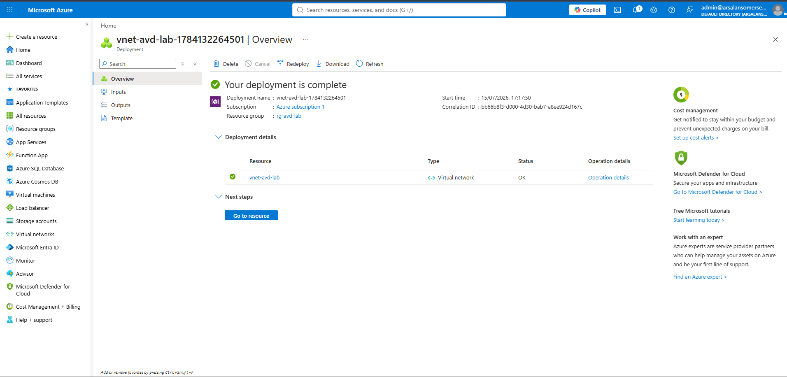
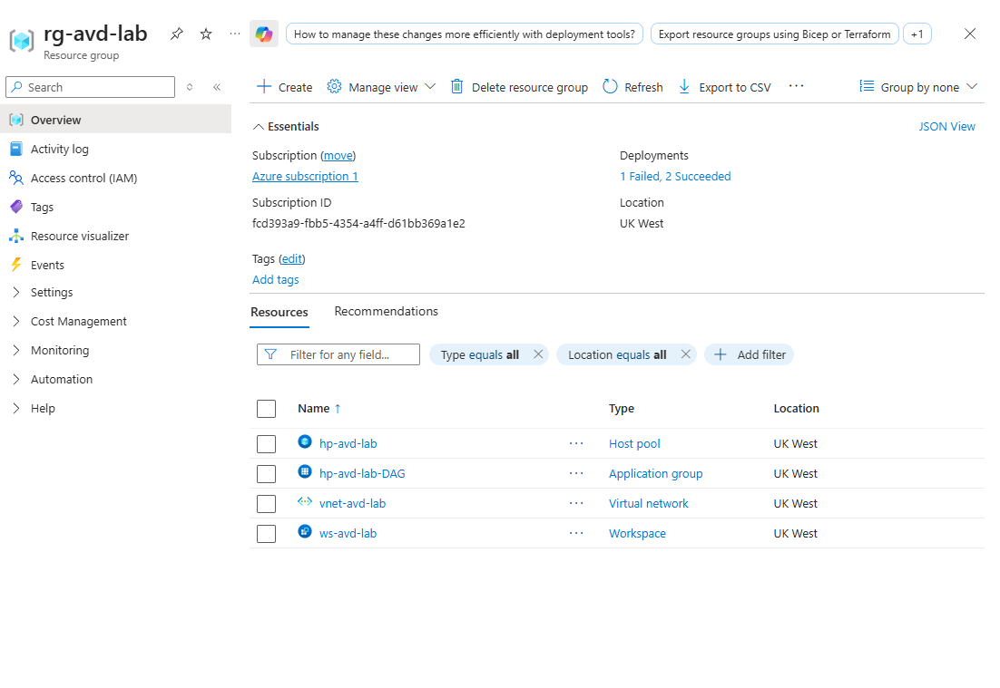

# Phase 4.4 — Advanced Desktop Cloud Virtualisation (Azure Virtual Desktop)

**Objective:** Provision an Azure Virtual Desktop (AVD) host pool that delivers a cloud-hosted Windows desktop, mapping user login profiles to the hybrid-synchronised Entra ID directory established in Phase 4.1 — the project's first workload running as *compute in the cloud* rather than in the on-premises VMware lab.

**Status summary:** The full AVD framework — subscription, virtual network, host pool, application group, and workspace — was deployed and Entra-joined. The **session-host VM did not deploy**, blocked by a free-trial vCPU quota of **0** in the region (a known trial limitation, not a configuration fault). Resolution path documented below.

---

## 1. Concept — what AVD is, and why this is the cloud pivot

**Azure Virtual Desktop** is Microsoft's Desktop-as-a-Service: instead of a Windows desktop running on a physical PC, the desktop runs as a **VM inside an Azure datacentre**, and the user streams the screen to any device. It's how enterprises deliver secure, managed desktops to remote workers and contractors without shipping hardware.

This phase is the genuine **cloud pivot** of the project. Phases 2–3 were on-premises; Phases 4.1–4.3 were *hybrid* (bridging on-prem up to cloud identity and management). Phase 4.4 is the first time a workload — an actual Windows session — **executes in the cloud**, on Azure compute. That shift from *managing* endpoints to *hosting* them is exactly what the "cloud engineer" role means, and it's why this phase incurs real (credit-covered) compute cost.

*Interview relevance (Cloud Administrator / Infrastructure Engineer):* DaaS/VDI, host pools, session hosts, and identity-mapped cloud desktops are core cloud-infrastructure concepts.

---

## 2. Architecture

The flow: a **hybrid-synced pilot user** → connects via the **AVD client** → **Workspace** → **Desktop application group** → a **session-host VM** running their Windows desktop in Azure. **Entra ID** authenticates every hop.

**Key design decision — Entra-joined host pool.** The session host joins **Microsoft Entra ID directly** (not the on-prem AD). Two reasons this is the right call:

1. It maps the cloud desktop straight to the **hybrid-synced directory** — the same identity plane your on-prem users flow into via Entra Connect. A user *born on-prem*, synced to Entra, can sign into a desktop *running in Azure*. That is the payoff of all the 4.1 work.
2. It needs **no VPN back to the on-prem VMware lab** — which doesn't exist until Phase 8A. An on-prem-AD-joined host pool would require that connectivity; Entra-join sidesteps it entirely.

*Principle — least connectivity / right identity boundary:* choose the identity model that meets the requirement with the fewest moving parts. Entra-join delivered the hybrid-identity mapping without introducing a site-to-site VPN dependency.

---

## 3. What was deployed

A brand-new **Azure subscription** (free trial, £200 credit) was created — the compute plane, separate from the M365 E5 tenant but in the same Entra directory so synced identities flow through.

Within resource group **`rg-avd-lab`** (UK West), the following were deployed successfully:

| Resource | Name | Purpose |
|---|---|---|
| Virtual network | `vnet-avd-lab` | Network for the session hosts |
| Host pool | `hp-avd-lab` | Pooled, Desktop; holds the session hosts |
| Application group | `hp-avd-lab-DAG` | Desktop app group — delivers a full desktop |
| Workspace | `ws-avd-lab` | What the user sees in the AVD client |

Host pool configured as **Pooled / Desktop**, session hosts set to **Windows 11 Enterprise multi-session 24H2**, size **Standard D2as v5**, **Entra ID** domain join, no public inbound ports (AVD uses secure reverse-connect).

*Evidence 1 — the AVD virtual network deployed to rg-avd-lab, UK West.*

*Evidence 2 — host pool, application group, virtual network, and workspace all deployed and Entra-joined (Deployments: 1 failed, 2 succeeded — the failure being the session-host VM, below).*

---

## 4. Open item — session-host VM blocked by free-trial quota

The session-host VM deployment failed at preflight validation (`InvalidTemplateDeployment` → `Microsoft.Compute/virtualMachines` preflight error). Root cause traced to the subscription's **vCPU quota**:

> **Standard DASv5 Family vCPUs, UK West: limit = 0 (0 of 0).**

The chosen VM size (D2as v5) belongs to the DASv5 family, which has **zero allocated quota** on a fresh Azure free-trial subscription. Azure blocks the deployment before it starts — this is an **external trial limitation, not a configuration error**; the host pool, network, app group, and workspace all deployed correctly with the same template.

**Resolution path (a short follow-up, not a rebuild):**
- The free trial does not permit quota increases directly. The standard fix is to **convert the subscription to Pay-As-You-Go** (still runs on the remaining £200 credit; £0 charged until credit is exceeded), which lifts the trial's zero-quota caps.
- Then **add a session host** to the *existing* `hp-avd-lab` host pool (no rebuild of the framework), and complete the remaining steps: assign pilot users to the desktop app group, grant the **"Virtual Machine User Login"** RBAC role (required for sign-in on Entra-joined hosts), and connect via the AVD web client to prove a synced identity lands on a cloud desktop.

**Lesson documented:** on a fresh Azure subscription, **check vCPU quota for the target VM family and region before deploying** — many families ship at 0 quota. A `Microsoft.Compute` preflight `InvalidTemplateDeployment` with no obvious cause is very often a quota wall; the Quotas blade confirms it in seconds. Recurring principle: verify capacity/limits before committing a deploy, the cloud equivalent of "never trust silence as success."

---

## 5. Dependency note

AVD (4.4) is a **leaf** in the project — no later phase depends on a running AVD desktop. Phase 5 (SharePoint / Power Automate) and the AWS phases (4.5–4.7) are unaffected. The session-host completion can be done at any time via the Pay-As-You-Go path above without blocking downstream work.

---

*Environment: Azure subscription (free trial) · resource group rg-avd-lab (UK West) · Entra tenant df8403b0-4503-4df0-9f25-40f6c0d0a932 · hybrid-synced identities from Phase 4.1. Additional evidence available: `avd-quota-blocker.png` (the 0-quota page) and `avd-deployment-partial.png` (framework succeeded, VM failed).*
